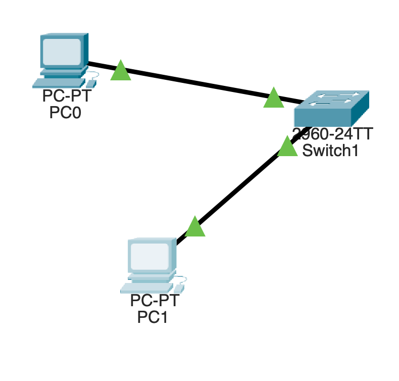
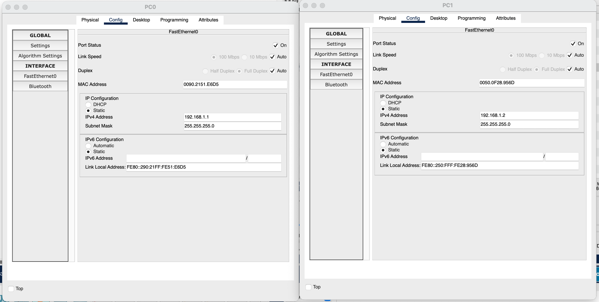
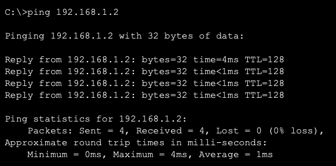
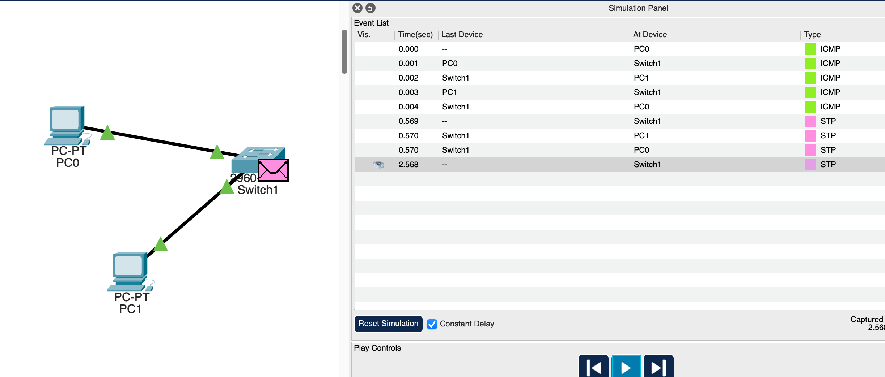
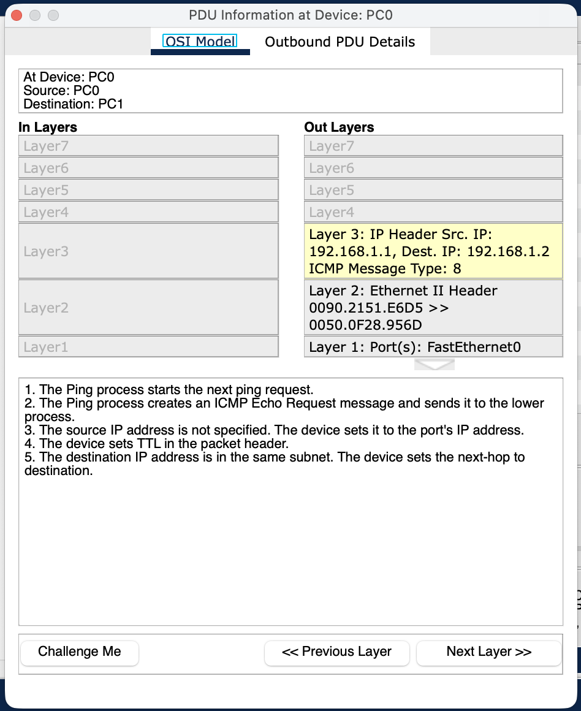
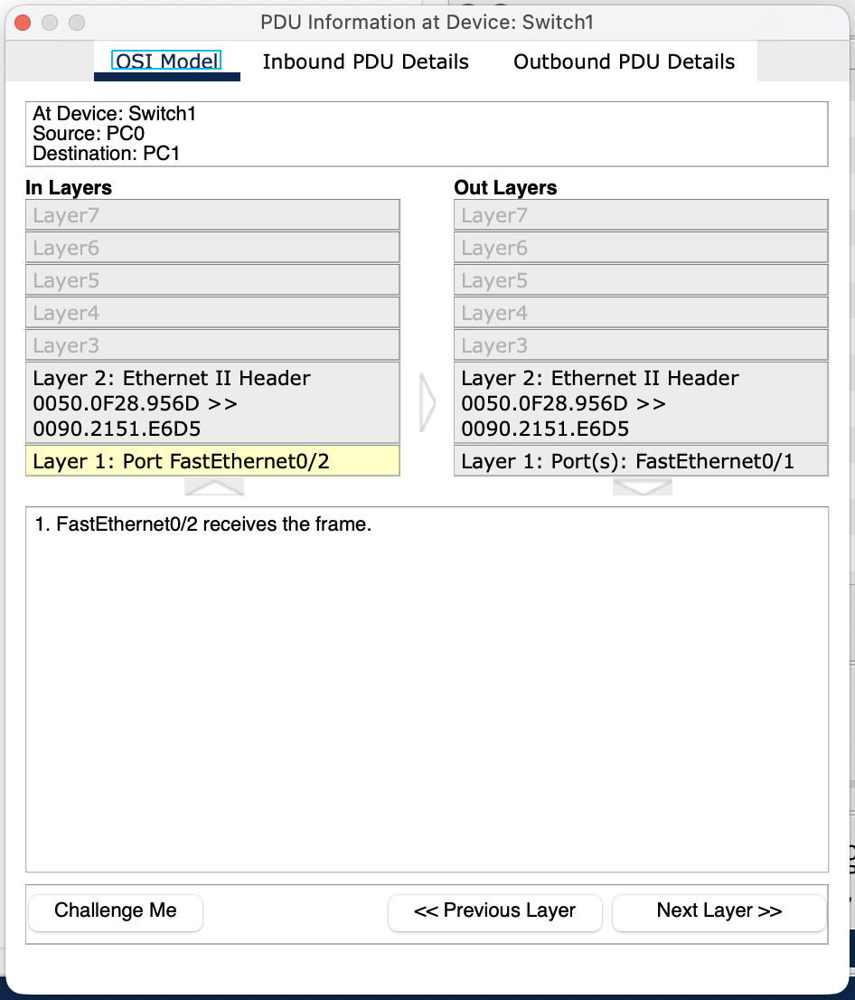
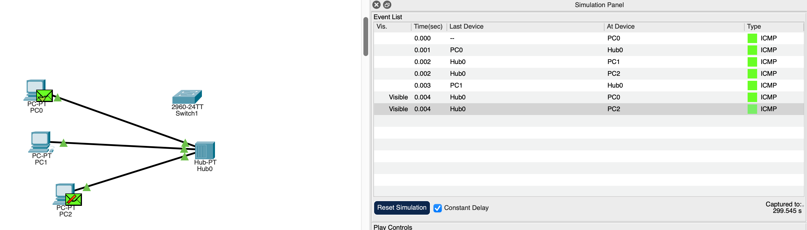
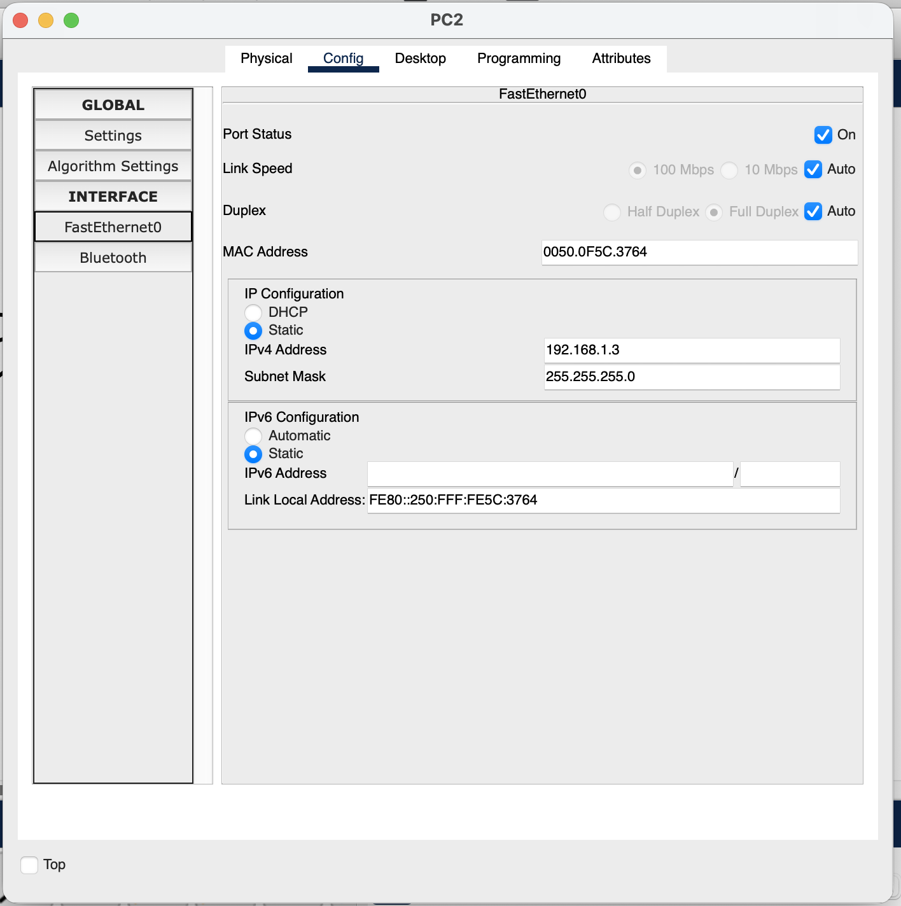
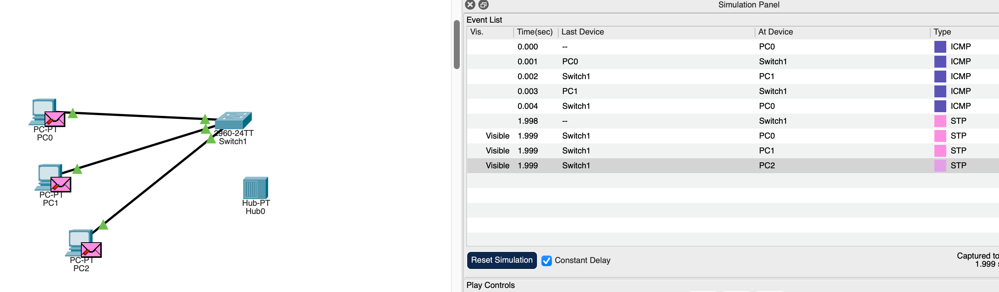
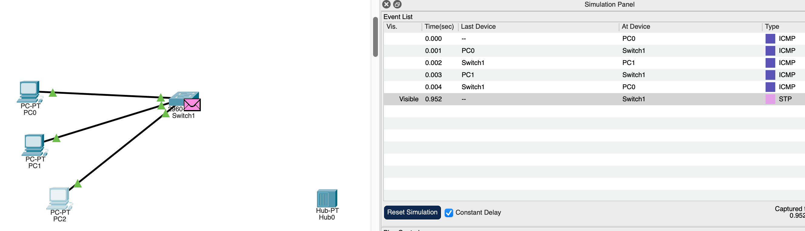

  
  
    <strong>Lab 02:</strong> Network Performance, Layers & Security 
    <strong>Course:</strong> Networks System Design 
    <strong>Name:</strong> Do Davin 
    <strong>Student ID:</strong> P20230018 
    <strong>Instructor:</strong> Mr. Kuy Movsun 
    <strong>Due Date:</strong> October 28, 2025 (12:00 AM)
  

 

# Activity 1 — Network Performance: Delay, Loss & Throughput

## Part A — Manual Calculation (Math-Safe Markdown)

### Given Information
| Parameter | Symbol | Value |
|---|:---:|---|
| File size | F | 5 MB = 5 × 10^6 bytes |
| Link rate | R | 10 Mbps = 10 × 10^6 bits/s |
| Packet size | L | 1500 bytes = 1500 × 8 = 12,000 bits |
| Round-trip time | RTT | 50 ms (not directly used below) |
| Packet loss | p | 2% = 0.02 |

---

### 1) Transmission Delay for One 1500-Byte Packet
**Formula (text):** `d_trans = L / R`  
**Substitute:** `d_trans = 12,000 bits / 10,000,000 bits/s`  
**Result:** `d_trans = 0.0012 s = 1.2 ms`

---

### 2) Total Transfer Time for 5 MB File (Ideal)
**Formula (text):** `Transfer time = File size (bits) / R`  
**Convert size:** `5 × 10^6 bytes × 8 = 40 × 10^6 bits`  
**Substitute:** `Transfer time = 40 × 10^6 / 10 × 10^6 = 4 s`  
**Result:** `4 seconds`

---

### 3) Effective Throughput with 2% Loss
**Formula (text):** `Effective Throughput = R × (1 − loss rate)`  
**Substitute:** `10 Mbps × (1 − 0.02) = 9.8 Mbps`  
**Result:** `9.8 Mbps`

---

### Final Answers
| Calculation | Formula | Result |
|---|---|---|
| Transmission delay (one packet) | `d_trans = L / R` | **1.2 ms** |
| Ideal transfer time (5 MB) | `File size / R` | **4 s** |
| Effective throughput (2% loss) | `R × (1 − loss rate)` | **9.8 Mbps** |

---

# Part B. Packet Tracer Measurement

### **1. Create a simple topology: PC0 — Switch — PC1 with straight-through cables.**

### **2. Assign IPs: PC0 192.168.1.1/24, PC1 192.168.1.2/24.**

### **3. Test connectivity from PC0 using ping 192.168.1.2.**

### **4. Switch to Simulation Mode → use the Simple PDU (envelope icon) from PC0 → PC1.**
### **5. Open the Event List and record the time when the Echo Request leaves PC0 and when the Echo Reply returns to PC0 (this is your RTT).**
### **6. Assume each Simple PDU ≈ 600 bits (typical ICMP ping).**

### **7. Calculate throughput using Throughput (bps) = Packet Size (bits) / RTT (seconds).**

## Results
| Test | Packet Size (bits) | RTT (ms) | Throughput (bps) | Loss (%) |
| :--: | :-----------------: | :------: | :--------------: | :------: |
|   1  |         600         |     4    |    **150 000**   |     0    |
|   2  |         600         |     4    |    **150 000**   |     0    |

## Discussion Prompts

### **1. Delays observed in Simulation Mode**
- **Transmission Delay:** Time to push bits onto the link.  
- **Propagation Delay:** Time for the signal to travel through the medium (e.g., copper cable).  
- **Processing Delay:** Time taken by devices (PCs, switches) to process or forward packets.  
- **Queueing Delay:** Appears when many PDUs are sent quickly, causing temporary waiting in the switch buffer.  

---
### **2. Effect of Sending Multiple PDUs Quickly**
- Increases **queueing delay** as packets wait in line for transmission.  
- May cause **packet loss** if the switch buffer becomes full.  
- Results in **fluctuating (jittery) RTT values**, as some packets take longer to process.  
---

### **3. Impact of Link Speed on Throughput**
- **Higher link rate → lower transmission delay** and higher achievable throughput.  
- With the same RTT, **throughput scales directly with link speed**.  
- **Losses or congestion** reduce the *effective* throughput by:  
  **Effective Throughput = R × (1 − loss rate)** 

# 🔗 Activity 2 — Protocol Layers & Encapsulation 

## Option A: Cisco Packet Tracer

### **1. Use the same PC0 – Switch – PC1 topology in Simulation Mode.**
---
    | Device | IP Address  | Subnet Mask   |
    | ------ | ----------- | ------------- |
    | PC0    | 192.168.1.1 | 255.255.255.0 |
    | PC1    | 192.168.1.2 | 255.255.255.0 |
---
Connection Type: Copper Straight-Through Cable
* PC0 -> Switch1 (FastEthernet0/1)
* PC1 -> Switch1 (FastEthernet0/2)

### **2. Send a Simple PDU from PC0 → PC1.**

## Outbound PDU Details

## Inbound PDU Details

### **3. In the Event List, click the packet → PDU Information.**

---
| Layer                   | Protocol          | Header Information                                    | Description                            |
| ----------------------- | ----------------- | ----------------------------------------------------- | -------------------------------------- |
| **Layer 3 (Network)**   | **IP**            | Src: 192.168.1.1 Dest: 192.168.1.2 ICMP Type: 8 | Adds IP header for logical addressing  |
| **Layer 2 (Data Link)** | **Ethernet II**   | Src MAC: 0090.2151.E6D5 Dest MAC: 0050.0F28.956D   | Adds Ethernet frame for local delivery |
| **Layer 1 (Physical)**  | **FastEthernet0** | Port: FastEthernet0                                   | Converts data to bits for transmission |
---

## Encapsulation Order:
ICMP -> IP -> Ethernet

The Ping (ICMP Echo Request) message is wrapped in an IP packet, then inside an Ethernet frame before being sent out through the physical port.

### **4. Review Outbound PDU Details (headers added) and Inbound PDU Details (headers removed).**

---
| Direction    | Layer | Protocol                                              | Description                                          |
| ------------ | ----- | ----------------------------------------------------- | ---------------------------------------------------- |
| **Inbound**  | L2    | Ethernet II Header `0050.0F28.956D >> 0090.2151.E6D5` | Switch receives the frame on **FastEthernet0/2**     |
| **Outbound** | L2    | Ethernet II Header (same)                             | Switch forwards frame via **FastEthernet0/1** to PC1 |
---

The switch operates at Layer 2, so it doesn't modify IP or ICMP headers. It checks the destination MAC, looks it up in its MAC address table, and forwards the frame to the correct port (toward PC1).

### **5. Identify visible layers and headers (Ethernet/MAC, IP, ICMP).**

---
| Layer                  | Protocol               | Description                              |
| ---------------------- | ---------------------- | ---------------------------------------- |
| **Layer 2 (Ethernet)** | Frame header removed   | PC1 removes the Ethernet frame           |
| **Layer 3 (IP)**       | IP header removed      | PC1 processes the IP packet              |
| **Layer 4 (ICMP)**     | ICMP message processed | PC1 receives and replies to Ping request |
---

## Decapsulation Order:
Ethernet -> IP -> ICMP

PC1 removes headers layer by layer as data moves up the OSI model, finally reading the ICMP Echo Request and sending an Echo Reply back to PC0.

# 🔒 Activity 3 — Security Visibility: Hub vs Switch

## Part A. Hub Network

### **1. Build 3 PCs (PC0, PC1, PC2) + 1 Hub.**

### **2. Assign IPs: PC0 192.168.2.1, PC1 192.168.2.2, PC2 192.168.2.3.**

## PC0 and PC1:

## PC2:

### **3. Switch to Simulation Mode → send Simple PDU from PC0 → PC1.**
### **4. Observe whether PC2 receives a copy of the packet.**

## Part B. Switch Network

### **1. Replace the hub with a Switch and reconnect PCs (same IPs).**

### **2. Repeat the Simple PDU test PC0 → PC1 and observe packet visibility at PC2.**

  <strong>END<strong>

