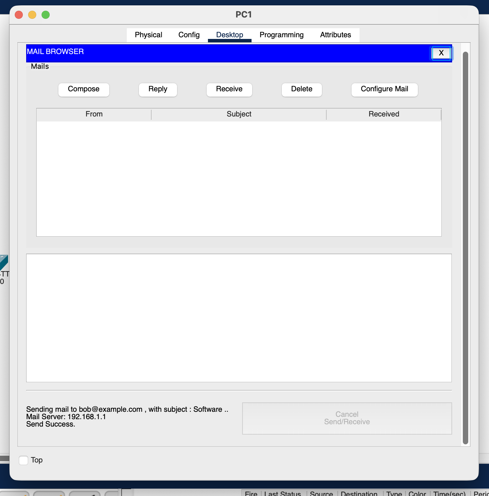
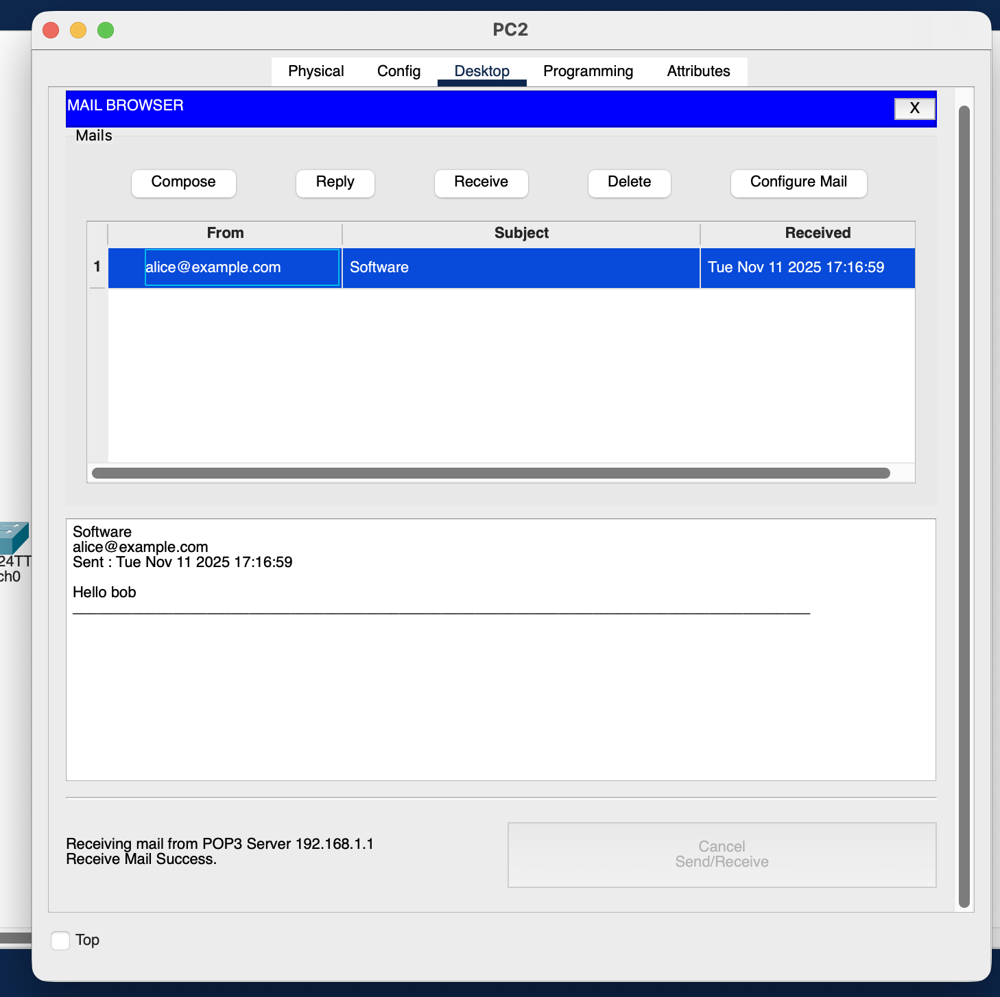
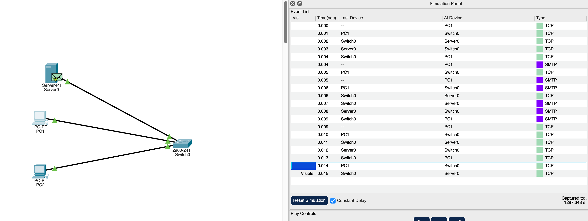
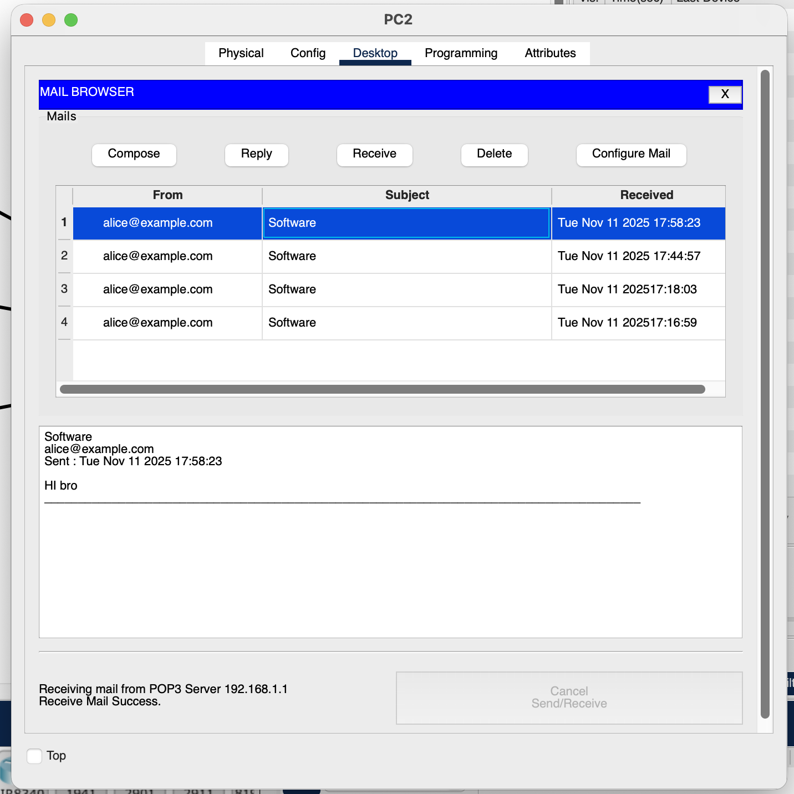

  
  
    <strong>Lab 03:</strong> HTTP, DNS, and Email in Cisco Packet Tracer 
    <strong>Course:</strong> Networks System Design 
    <strong>Name:</strong> Do Davin 
    <strong>Student ID:</strong> P20230018 
    <strong>Instructor:</strong> Mr. Kuy Movsun 
    <strong>Due Date:</strong> Tuesday, 18 November 2025
  

 

## Part A – HTTP Requests and Responses

1. On the Server → Services → HTTP, switch HTTP = On.
2. Notice the default file list already contains index.html and image files (e.g., logo.gif, background.png). These built-in files already include embedded objects.
3. On PC1 → Desktop → Web Browser, enter http://192.168.1.1.
4. You should see the default Cisco Packet Tracer Server page with text and images. Open it.
5. Switch to Simulation Mode. Filter protocols to show HTTP and TCP.
6. Click Go/Refresh in the browser and watch multiple HTTP GET requests (for the HTML page and each embedded image or CSS file).

### 1. How many HTTP requests were sent?

From the simulation event list, at least one HTTP request was transmitted. This can be seen in the "Type" column, where an entry marked HTTP shows that a web request was made from the PC to the server.

### 2. What transport protocol does HTTP use?

HTTP operates over the TCP (Transmission Control Protocol). This is evident from the multiple TCP events before and after the HTTP packets in the simulation, confirming that TCP is used to establish a reliable connection for transmitting HTTP data.

### 3. Why does one web page request result in multiple HTTP requests?

A single web page typically contains various embedded elements like images, CSS files, and scripts, each requiring a separate HTTP GET request. As a result, loading one page generates multiple HTTP requests—one for the main HTML file and others for its embedded resources. In this simulation, only one HTTP request is shown, likely representing the main page request.

## Part B – HTTP GET and Response Details

## DNS and HTTP Communication Sequence

1. On the Server → Services → DNS → switch DNS = On.
2. Add an A record: Host: www.example.com → Address: 192.168.1.1.
3. On PC1 and PC2 → Desktop → IP Configuration → 4. set DNS Server = 192.168.1.1.
4. On PC1 browser, visit http://www.example.com .
5. Switch to Simulation Mode and enable filters for DNS, HTTP, and TCP.

6. Observed Sequence:

   1. **DNS Query → Server**
      PC1 sends a DNS request to resolve a domain name (e.g., `www.example.com`) into an IP address.

   2. **DNS Response with IP Address**
      The DNS server replies with the corresponding IP address of the web server (Server0).

   3. **HTTP GET to That IP**
      Using the resolved IP address, PC1 initiates an HTTP GET request to retrieve the web page from Server0.

### Explanation:

This sequence demonstrates that DNS resolution is required before HTTP communication can occur. Without DNS translating the domain name into an IP address, the PC cannot locate the server to send the HTTP request. Once the IP address is resolved, the browser establishes a TCP connection and uses HTTP to request the web content.

### Questions

### What happens if the DNS Server address on the PC is wrong?

If the DNS server address is incorrect, the PC will be unable to resolve domain names into IP addresses. Consequently, the browser cannot locate the web server to send the HTTP request, causing the web page to fail to load. A "Server not found" or "DNS error" message will typically appear.

### Why is DNS important before HTTP communication?

DNS is crucial because it converts domain names (like www.google.com) into IP addresses that computers need to communicate over the network. Without DNS resolution, the PC cannot find the server’s IP address, preventing HTTP communication from starting.

## Part C – Email Transfer using SMTP and POP3

### Send and Receive

### Send and Receive with simulation

### Which protocol sent the email to the server?

The protocol used to **send** the email from Alice (PC1) to the server is **SMTP (Simple Mail Transfer Protocol)**.

### Which protocol retrieved the email from the server?

The protocol used to **retrieve** the email by Bob (PC2) from the server is **POP3 (Post Office Protocol version 3)**.

### Why does email use two different protocols instead of one?

Email relies on two protocols because each handles a different function:

- ***SMTP*** is used for sending emails from a client to a mail server or between mail servers.
- ***POP3*** is used for retrieving emails from a mail server to a client.

This separation allows email systems to manage sending and receiving processes independently, improving reliability and flexibility.

### Reflection:
How do DNS and HTTP work together to allow users to access a website by name? Compare this to how email uses SMTP and POP3 for sending and receiving. What is similar about their client–server models?

DNS and HTTP work together by combining name resolution and data transfer.

- DNS first translates the website’s domain name (e.g., www.example.com) into its IP address, allowing the client to locate the correct web server.

- Once the IP is known, HTTP establishes a client–server connection over TCP to request and deliver the webpage content.

Similarly, in email communication,

- SMTP handles the sending of messages from the client to the mail server (and between servers),

- while POP3 manages the retrieval of messages from the mail server to the client.

