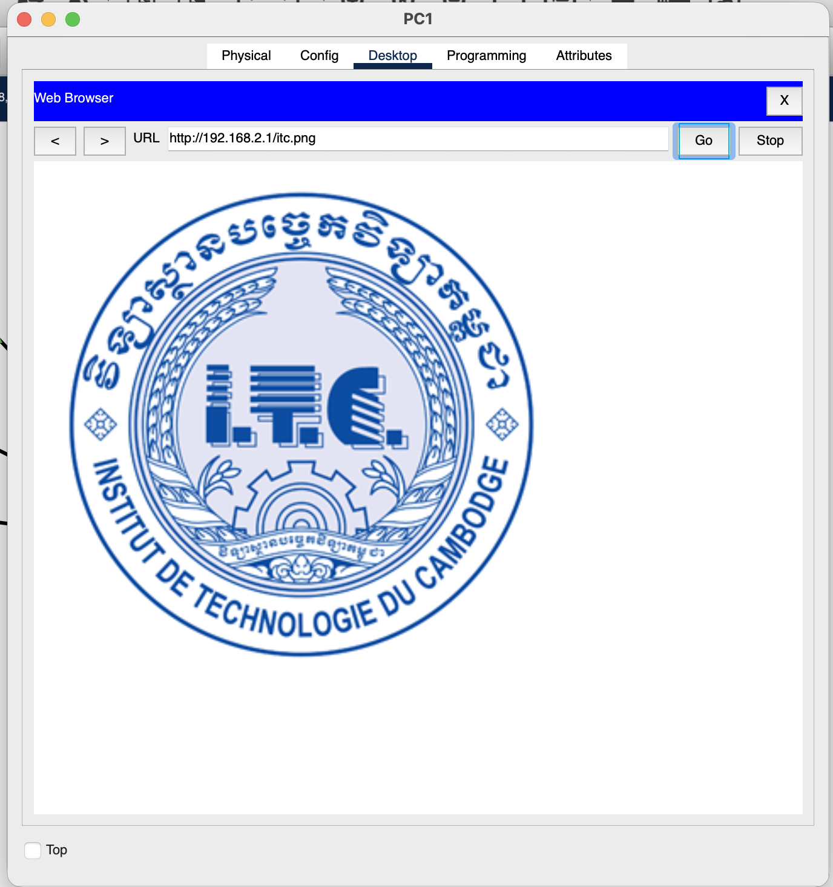
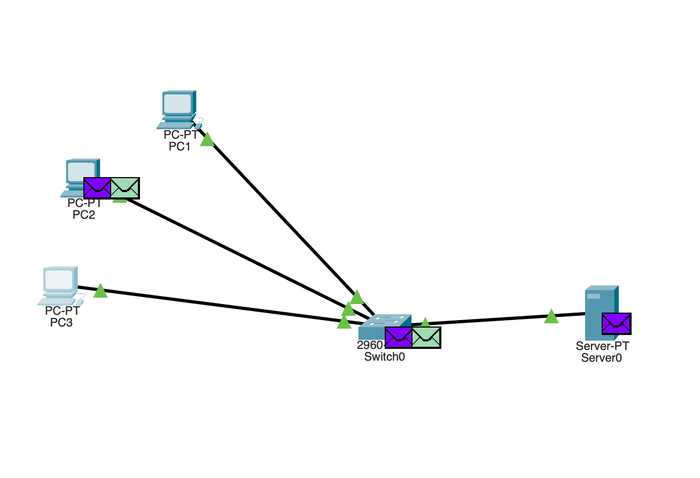
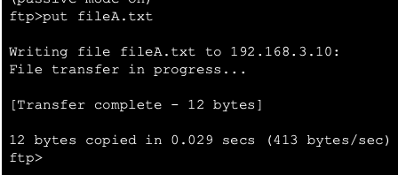
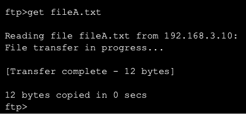
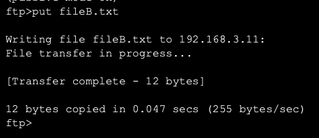
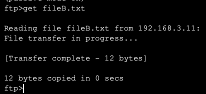
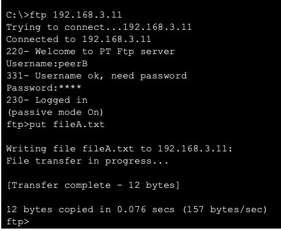
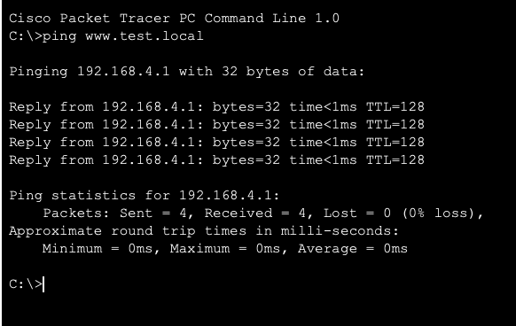
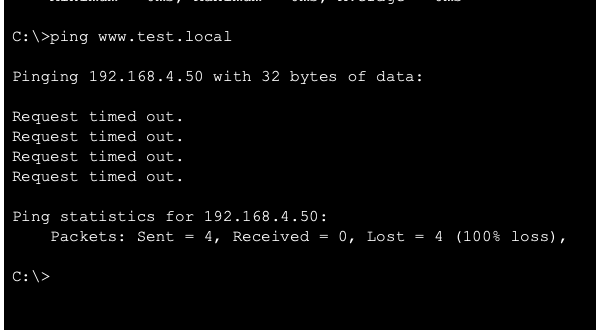

  
  
    <strong>Lab 04:</strong> HTTP, DNS, and Email in Cisco Packet Tracer 
    <strong>Course:</strong> Networks System Design 
    <strong>Name:</strong> Do Davin 
    <strong>Student ID:</strong> P20230018 
    <strong>Instructor:</strong> Mr. Kuy Movsun 
    <strong>Due Date:</strong> Tuesday, 18 November 2025
  

 

# Activity 1 – Video Streaming and Server Load

**Q1: What happens to traffic on the link between the server and switch when all three PCs request the file?**

- All three PCs send simultaneous HTTP requests to the server.
- The server must deliver a full copy of `video.bin` to each client.
- This causes heavy traffic on the single server–switch link.
- Result: congestion and increased delay as multiple streams compete for bandwidth.

**Q2: How would the situation change if the file were copied to another server closer to one of the PCs (CDN idea)?**

- The nearby PC can fetch the file locally, reducing load on the original server link.
- Traffic is distributed across multiple servers instead of one central point.
- This lowers congestion and improves response times.
- This mirrors how CDNs replicate content to balance load and reduce latency.

**Q3: Why do real streaming services use buffering and multiple distributed servers?**

- Buffering allows clients to pre‑download video segments, ensuring smooth playback despite network delays.
- Distributed servers (CDNs) let users connect to nearby servers, reducing latency and avoiding bottlenecks.
- Together, these techniques improve scalability, reliability, and user experience.
- They enable millions of users to stream simultaneously without overwhelming a single server.

# Activity 2 – Peer-to-Peer Style Sharing via FTP

### 1. Upload fileA.txt to Server1

### 2. Download fileA.txt from Server1

### 3. Upload fileB.txt to Server2

### 4. Download fileB.txt from Server2

### 5. Upload fileA.txt to Server2:

### 6. Upload fileB.txt to Server1

## Result & Discussion

- After completing the activity, both **Server1** and **Server2** host `fileA.txt` and `fileB.txt`.
- This demonstrates how files can be replicated across multiple peers rather than being stored on a single central server.
- Each peer acts as both a **client** (downloading files) and a **server** (uploading files), which is the essence of peer-to-peer (P2P) systems.
- The result shows that content availability increases, load is distributed among peers, and reliance on one central server is reduced.
- In practice, this improves **fault tolerance** and **scalability**, since files remain accessible even if one peer goes offline.

---

## Questions & Answers

**1. How is this different from a single central server hosting all files?**

- In a central server model, all clients depend on one server for access.
- In P2P, files are distributed among peers, so multiple sources can provide the same file.
- This reduces bottlenecks and avoids overloading one server.

**2. In a real P2P system, how would new peers discover which peers have each file?**

- Real P2P systems use **peer discovery mechanisms** such as:
  - **Trackers** (e.g., in BitTorrent) that maintain lists of peers with specific files.
  - **Distributed Hash Tables (DHTs)** that map file identifiers to peers.
  - **Broadcast or query messages** within the network to locate peers holding the file.

**3. Why can P2P systems scale better than pure client–server systems for large distributions?**

- Because the more peers join, the more resources (bandwidth, storage) are available.
- Each new peer not only consumes but also contributes, so capacity grows with demand.
- This makes P2P highly scalable for distributing large files (e.g., software updates, media).

---

# Activity 3 – UDP and TCP Socket Programming (Python)

