<p style="display: flex; align-items: center;">
  
  <span style="font-family: Arial, sans-serif; line-height: 1.6;">
    <strong>Lab 05:</strong>
    <strong>Course:</strong> Networks System Design<br>
    <strong>Name:</strong> Do Davin<br>
    <strong>Student ID:</strong> P20230018<br>
    <strong>Instructor:</strong> Mr. Kuy Movsun<br>
    <strong>Due Date:</strong> Tuesday, 2 December 2025, 12:00 AM
  </span>
</p>
<hr style="border: 1px solid #ccc;">

<br/>

# Part 1: Lab Topology Setup

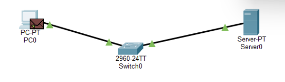

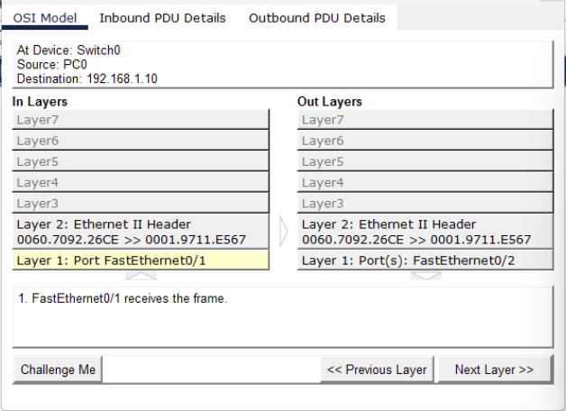

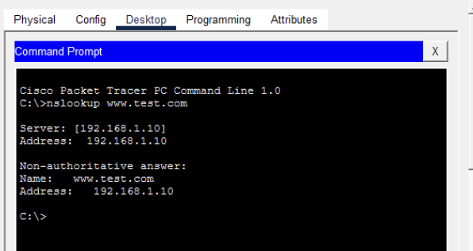

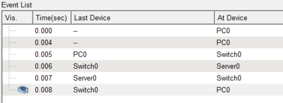

# Part 2 Visualizing UDP

## Analysis: Outbound PDU Details – UDP Section

- **Source Port**: 1027 — dynamically assigned by PC1 for the DNS query.
- **Destination Port**: 53 — standard port for DNS service.
- **Source IP**: 192.168.1.1 — IP address of PC1.
- **Destination IP**: 192.168.1.10 — IP address of the DNS server.
- **Protocol Used**: UDP — connectionless transport protocol suitable for DNS.
- **Application Layer Protocol**: DNS — initiates the query.
- **MAC Addresses**: PC1 (00E0.F999.2C9C) → Server (000A.F373.E8A8) via Ethernet.

This confirms that the DNS query is correctly encapsulated and routed using UDP to the DNS server.

### Lab Report Answers (Part 2 – UDP Analysis)

**Q1: How many bytes is the UDP header?**

The UDP header is 8 bytes in total, made up of four fields of 2 bytes each: Source Port, Destination Port, Length, and Checksum.

**Q2: What is the Destination Port number? Why this specific number?**

The Destination Port is 53, which is the well-known port assigned for DNS — meaning DNS servers listen on this port to accept incoming queries.

**Q3: Do you see "Sequence Number" or "Acknowledgment" fields? Why or why not?**

No, these fields are not present because UDP is a connectionless protocol and doesn’t provide reliability features. Sequence and acknowledgment numbers belong to TCP, which handles ordered and reliable data delivery.

### Part 3: UDP Checksum Calculation

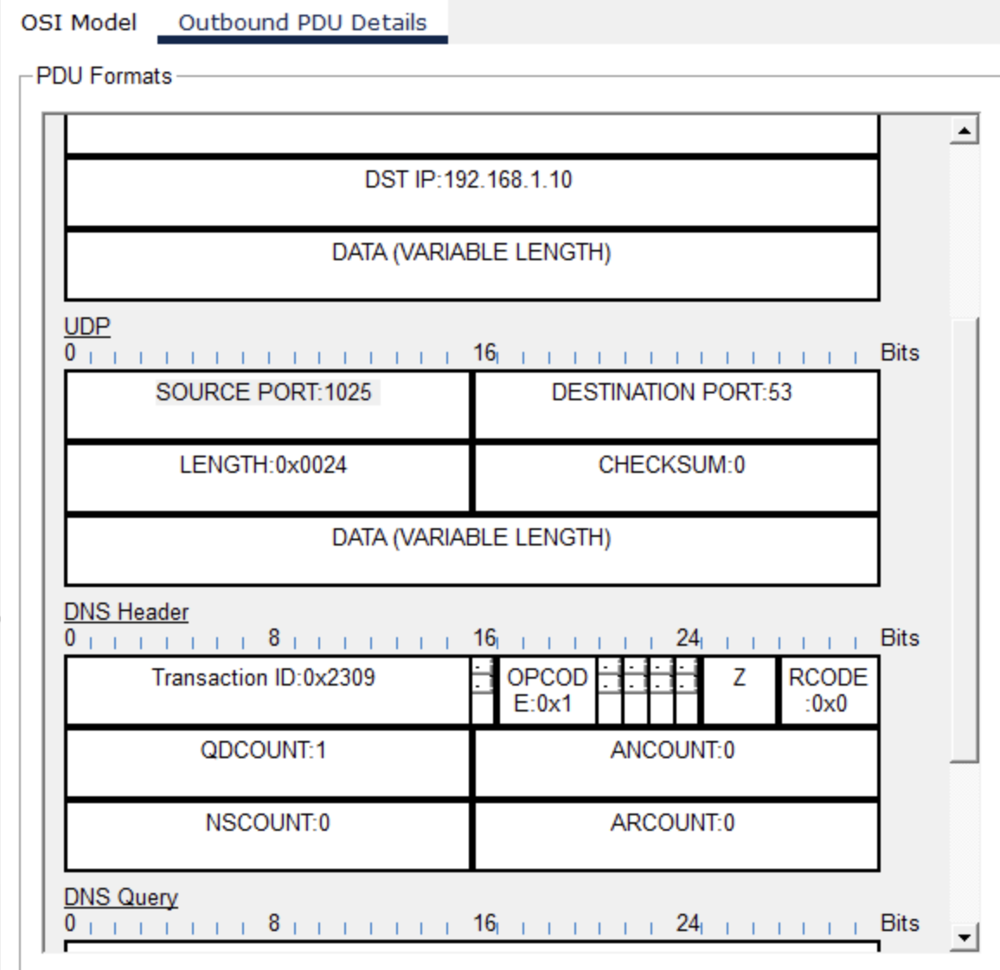

**Extracted 16-bit words:**

- Source Port: 1025 → 0x0401
- Destination Port: 53 → 0x0035
- Length: 0x0024
- Checksum (initial): 0x0000

**Step-by-step calculation:**

- Sum = 0x0401 + 0x0035 + 0x0024 = 0x045A
- Checksum = ~0x045A = 0xFBA5

**Receiver validation:**

- 0x0401 + 0x0035 + 0x0024 + 0xFBA5 = 0xFFFF → Packet is valid

**Error simulation:**

- Flip one bit in Length (e.g., 0x0025)
- New sum ≠ 0xFFFF → Error detected

### Part 3: UDP Checksum Calculation (Binary Method)

## **UDP Header Fields (16-bit words):**

**Step 1: The Sender (You)**

```
 0110011001100110
+0101010101010101
=1011101110111011
```

**Checksum: Flip every bit of your Sum (1s complement).**

```
Checksum = 0100010001000100
```

**Step 2: The Error**

```
Error! Corrupted Word 2: 0101010101010100
```

**Step 3: The Receiver**

Rule: If result is all 1s, data is valid. If any 0 exists, drop packet.
• Sum between Word 1 and Corrupted Word 2

```
 0110011001100110
+0101010101010100
=1011101110111010
```

Sum with Checksum

```
 1011101110111010
+0100010001000100
=1111111111111110
```

Lab Report Questions

**Q4: Did your final calculation result in all 1s?**

No. The final result I obtained was 1111111111111110, not all 1s (0xFFFF), so the checksum test fails — meaning an error was detected.

**Q5: Based on your result, would the receiver accept or drop this packet?**

The receiver would drop the packet, since the checksum didn’t produce all 1s — indicating the packet contains an error.

# Part 4: The Multiplexing Mixer

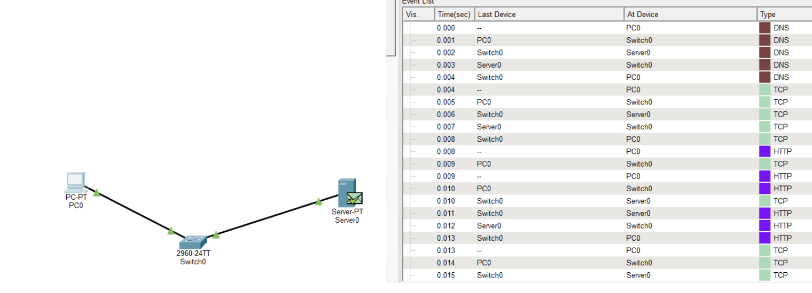
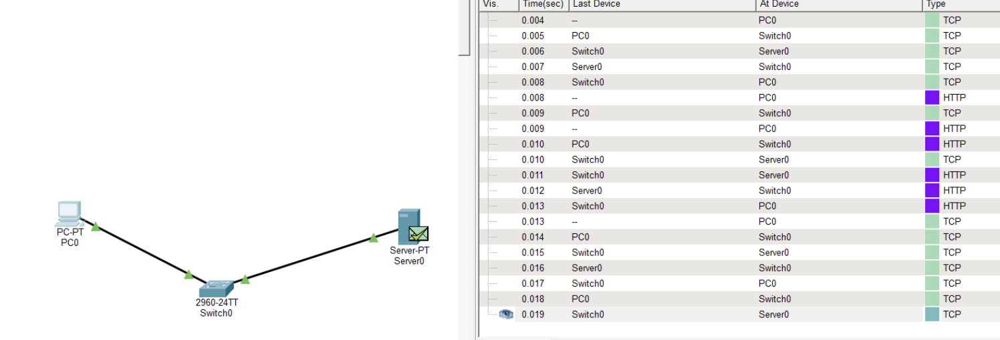
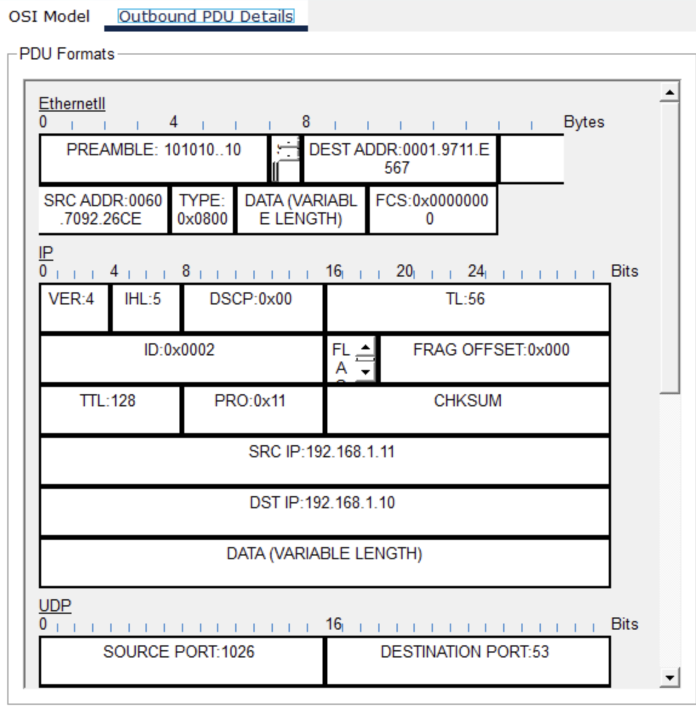
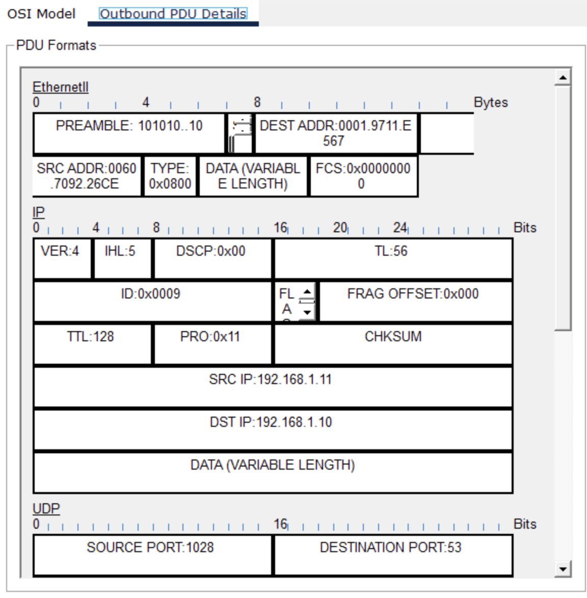
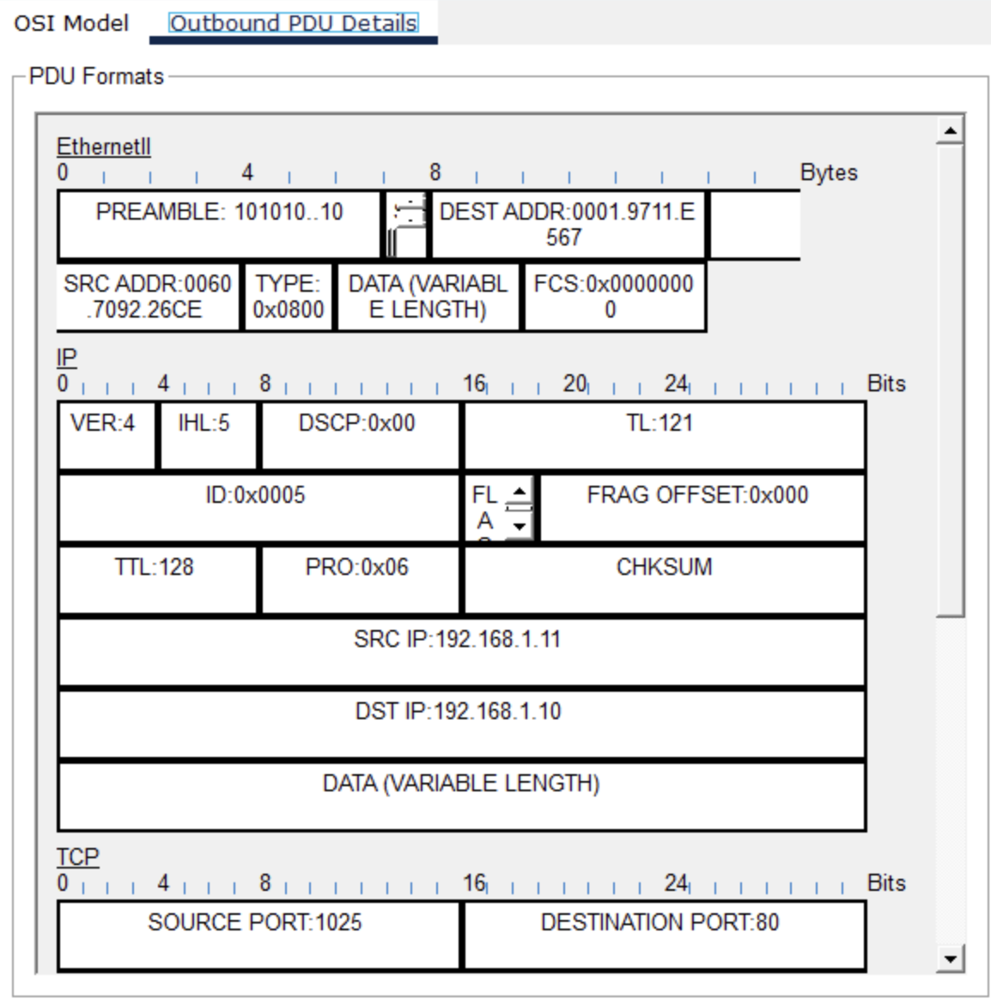
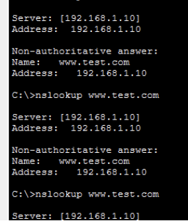

## Lab Report Questions Explanation
**Q1: (The House Address): What is the Destination IP Address for both packets? Is it the same?**

The Destination IP Address is the numeric identifier of the device receiving the packets—essentially the packet’s “home address.” In both packets, this value appears in the IP header and will be identical if they’re being sent to the same recipient. So, if the packets belong to the same communication flow, they should share the same destination IP.

**Q2: (The Room Number): Look at the Destination Port for HTTP vs DNS. What are they?**

The Destination Port specifies which service on the receiving device should process the packet.
For HTTP, the destination port is usually 80, the standard port for web requests.
For DNS, the destination port is 53, which DNS servers use to accept queries. These port numbers let the device route each packet to the correct application.

**Q3: Look at the Source Port for the HTTP packet. Is it 80? Explain why it is a random high number.**

No, the source port is not 80. Instead, the client uses a randomly chosen high-numbered ephemeral port (above 1023). This temporary port helps the OS uniquely identify the client’s connection, prevent conflicts with other sessions, and ensure the server can return responses to the correct process. The server listens on port 80, but the client always uses a random high port as the source.