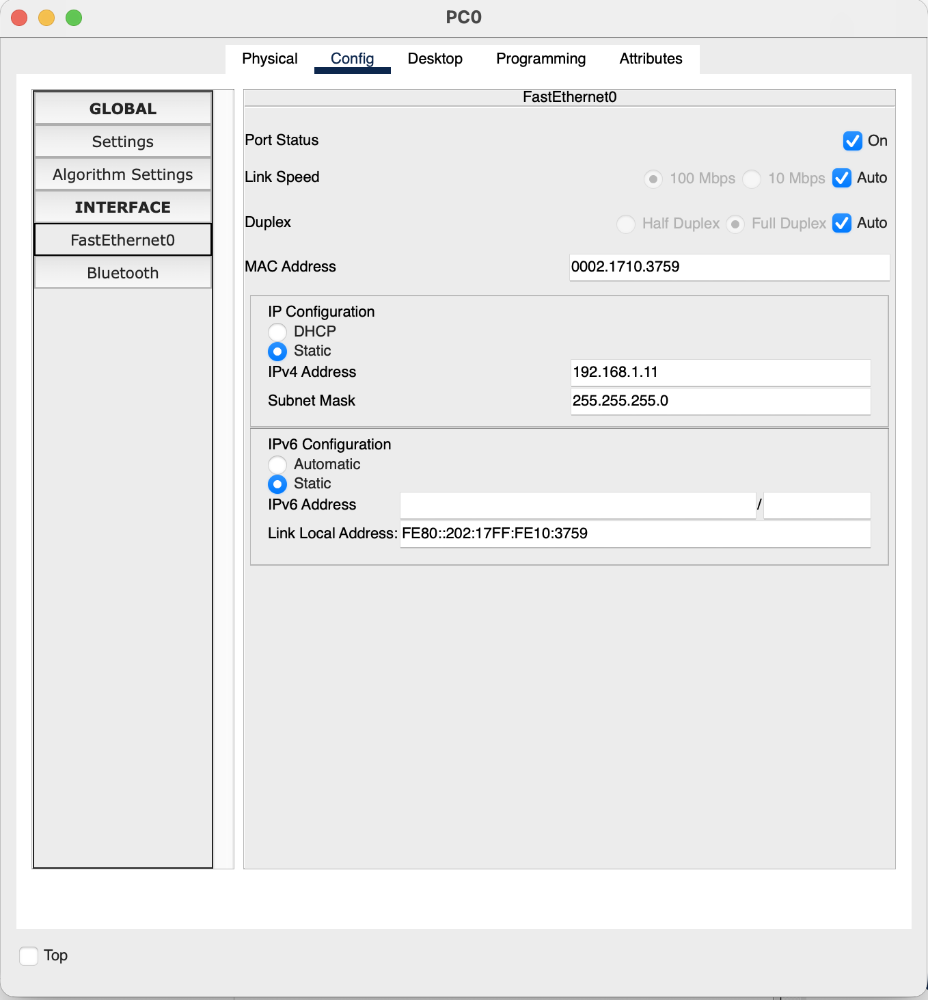
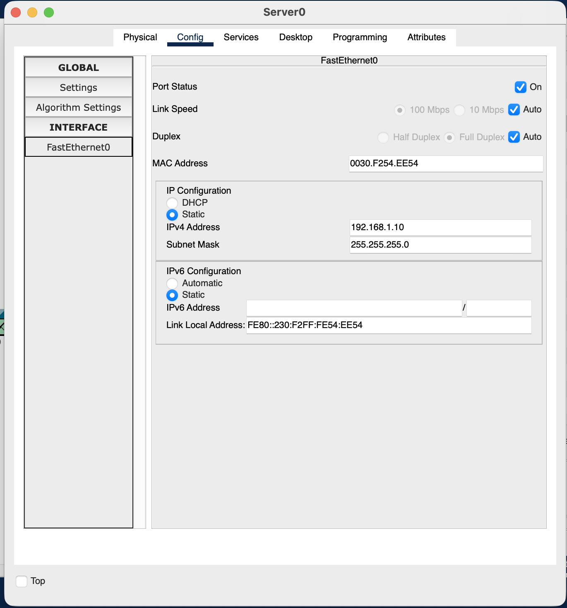
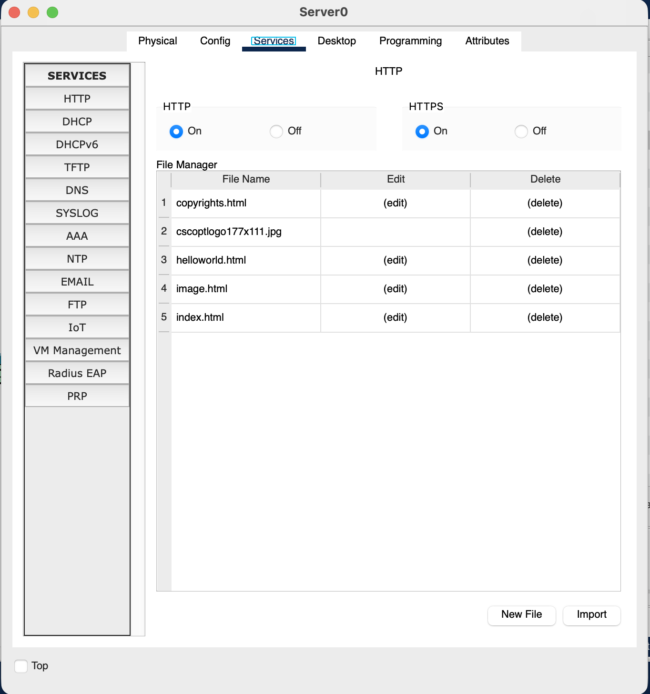
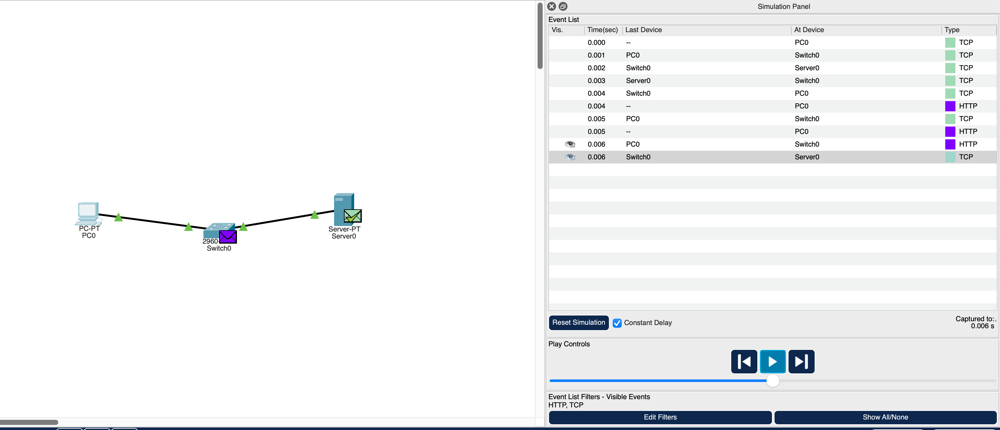
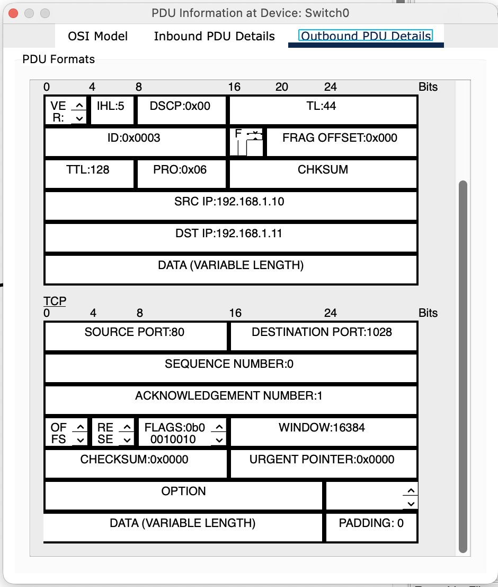
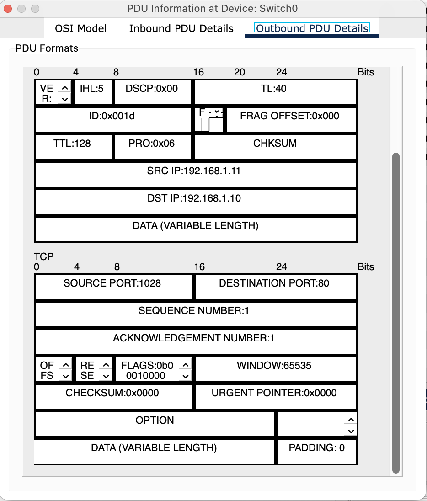
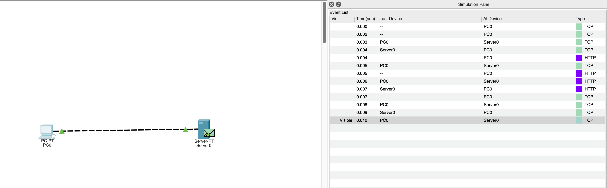
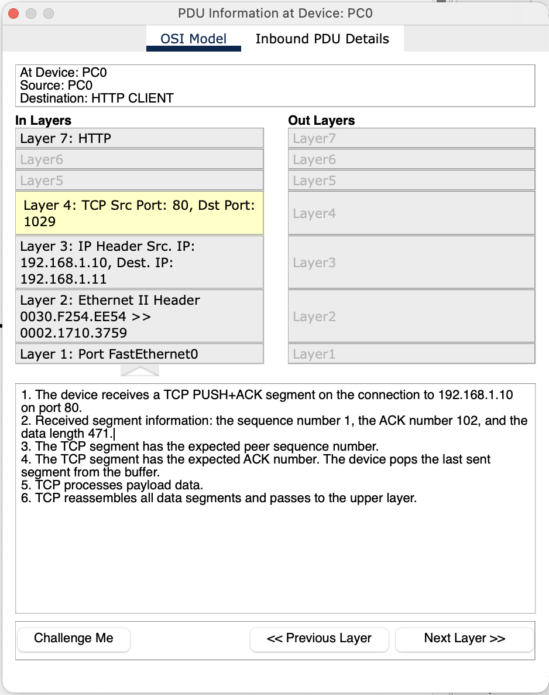
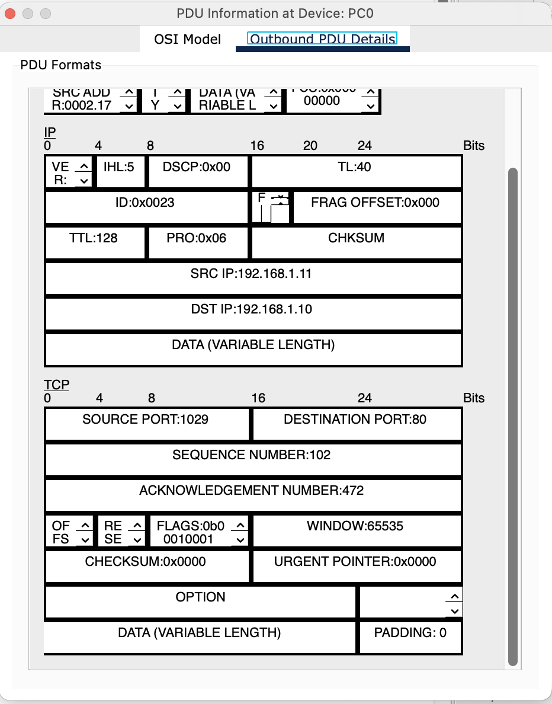

<p style="display: flex; align-items: center;">
  
  <span style="font-family: Arial, sans-serif; line-height: 1.6;">
    <strong>Lab 06</strong><br/>
    <strong>Course:</strong> Networks System Design<br>
    <strong>Name:</strong> Do Davin<br>
    <strong>Student ID:</strong> P20230018<br>
    <strong>Instructor:</strong> Mr. Kuy Movsun<br>
    <strong>Due Date:</strong> Tuesday, 2 December 2025, 12:00 AM
  </span>
</p>
<hr style="border: 1px solid #ccc;">

<br/>

Link to my GitHub:
<a href="https://github.com/Do-Davin/Network-Lab.git">https://github.com/Do-Davin/Network-Lab.git</a>

# Part 1: Lab Setup
### This section shows the basic network topology used in the simulation before starting all TCP experiments.




# Part 2: The 3-Way Handshake


# 📝 Lab Analysis

### Packet 1 (PC → Server):

Flag = SYN

This is the first step: PC initiates the connection.

### Packet 2 (Server → PC):

Flags = SYN and ACK

Server acknowledges the request and sends its own SYN.

### Packet 3 (PC → Server):

Flag = ACK

PC confirms the connection is established.

### Packet 1:

### Packet 2:

### Packet 3:


### Draw It: Sketch the 3 arrows on paper and label them (SYN, SYN-ACK, ACK).
```bash
PC → Server : SYN
Server → PC : SYN-ACK
PC → Server : ACK
```

### Analysis
* The TCP 3-Way Handshake establishes a reliable connection before any data is exchanged.
* Once the handshake is complete, the HTTP request–response process can start.

# Part 3: The Sequence Number Detective



### Task
* Continue simulation after the TCP handshake.
* Capture the HTTP response packet from Server0 to PC1.
* Inspect the TCP Header for:
  * Sequence Number (Seq)
  * Data Length (Len)

### Steps
1. Click Capture/Forward until the HTTP packet appears from Server0 → PC1.
2. Open the packet details and record:
    * Sequence Number (Seq): 1
    * Data Length (Len): 369
3. Predict the Acknowledgement Number:
    * Formula:
```css
Expected ACK = Seq + Len
```
4. Forward the next packet (PC1 → Server0).
5. Confirm the Acknowledgement Number matches your prediction.




# Analysis
* TCP uses sequence numbers to track byte order and ensure reliable delivery.
* The client acknowledges the last byte received + 1.
* This confirms successful receipt and readiness for the next segment.

# Part 4: Breaking the Network (TCP Retransmission)

### Task
* Observe how TCP handles packet loss by forcing a failure in the network.
### Steps
1. Reset Simulation completely.
2. Set filters to allow TCP packets.
3. On PC1, open the browser and request the website again (Server0).
4. Wait until the 3-Way Handshake is complete.
5. Before the HTTP packet returns, use the Delete Tool (X) to cut the cable between Server0 and Switch0.
6. Continue clicking Capture/Forward to observe events.
### Observations
* PC1 waits for the HTTP response but does not receive it.
* After a timeout, TCP automatically retransmits the packet.
* This shows TCP’s reliability mechanism: it detects loss and resends data.
### Analysis
* TCP Retransmission ensures reliable delivery by resending lost packets.
* If this were UDP (e.g., live video stream):
  * The packet would not be resent.
  * UDP is connectionless and does not guarantee delivery.
  * Lost packets simply result in missing frames or data.
### Key Takeaway
* TCP sacrifices speed for reliability (resends lost data).
* UDP sacrifices reliability for speed (no retransmission).

# Part 5: The Pipeline Race

### Scenario

- Link speed: **1 Gbps**
- Packet Transmission Time: **0.008 ms**
- Round Trip Time (RTT): **30 ms**
- Formula for Utilization:

```ini
U = (N × Transmission Time) / (RTT + Transmission Time)
```

### Questions & Calculations

**Q2 (Stop-and-Wait, N=1):**

U = (1 × 0.008) / (30 + 0.008) ≈ 0.000266 (or 0.0266%)

**Q3 (Pipelining, N=3):**

U = (3 × 0.008) / (30 + 0.008) ≈ 0.000799 (or 0.0799%)

**Q4 (Improvement Factor):**

Factor = U(N=3) / U(N=1) = 0.000799 / 0.000266 ≈ 3.0

### 📊 Results Table

| Scenario           | N   | Utilization (U) | Percentage     |
| ------------------ | --- | --------------- | -------------- |
| Stop-and-Wait      | 1   | 0.000266        | 0.0266%        |
| Pipelining         | 3   | 0.000799        | 0.0799%        |
| Improvement Factor | -   | ~3×             | 3 times better |

### Analysis

- **Stop-and-Wait** uses the link inefficiently because the sender must wait for every ACK before transmitting the next packet.
- **Pipelining** sends several packets at once, which boosts link utilization.
- With even 3 packets in the pipeline, the utilization becomes roughly three times higher.

# Part 6: Flow Control & Teardown

### Steps Performed

1. Reconnect cables between **Server0** and **Switch0**.
2. Load the webpage successfully from **PC1**.
3. Opened the **last TCP packet** received by PC1.
4. Found the **Window Size** field in the TCP header.
5. Close the browser.
6. Observe the **FIN packets** exchanged during connection termination.

### Key Findings
1. Flow Control (Window Size)
* **The Window Size** tells the server how many bytes the PC is currently able to receive.
* Example:

  * If the window size is 4096, PC1 is saying:

    "My buffer has room for 4096 more bytes, send only this much before waiting."
* This prevents the sender from overwhelming the receiver.
2. Connection Teardown (4-Step TCP Closing)
TCP closes connections gracefully using a four-step FIN handshake:
  1. PC1 → Server0: FIN
  2. Server0 → PC1: ACK
  3. Server0 → PC1: FIN
  4. PC1 → Server0: ACK

This ensures both directions of communication are properly closed.

### Analysis

* **Flow Control:** protects the receiver from buffer overflow by regulating how much data can be sent.
* **Teardown:** ensures both sides finish communicating cleanly, preventing data loss.
* Unlike UDP (no formal closing), TCP guarantees an orderly shutdown.

---
