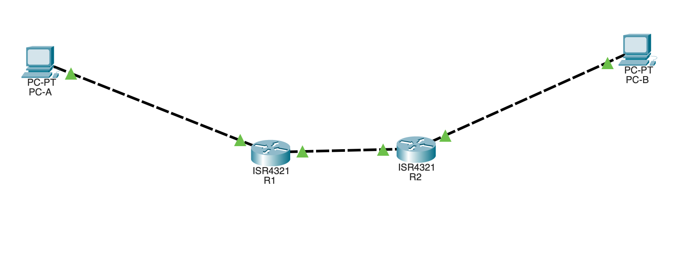
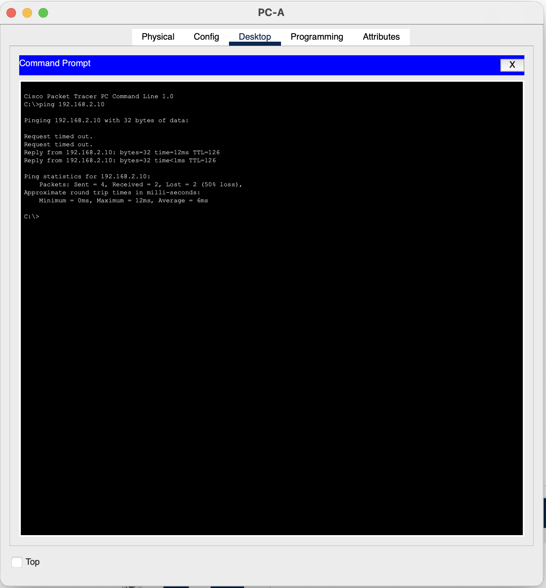
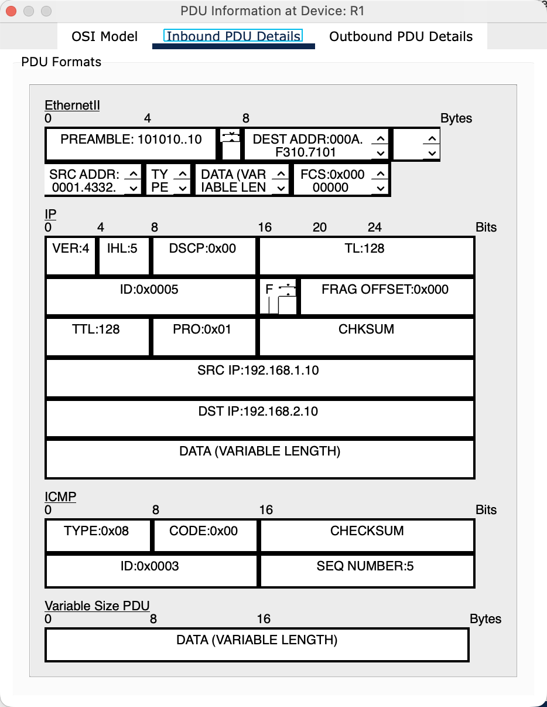
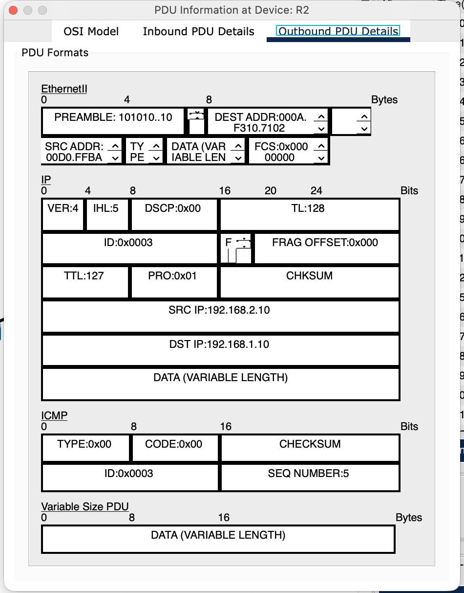
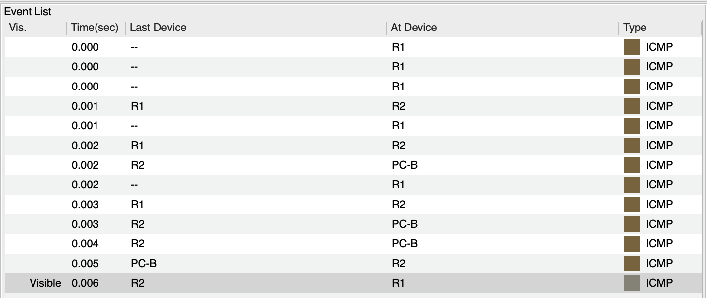
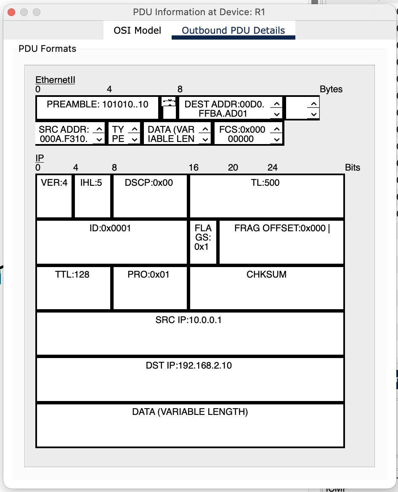
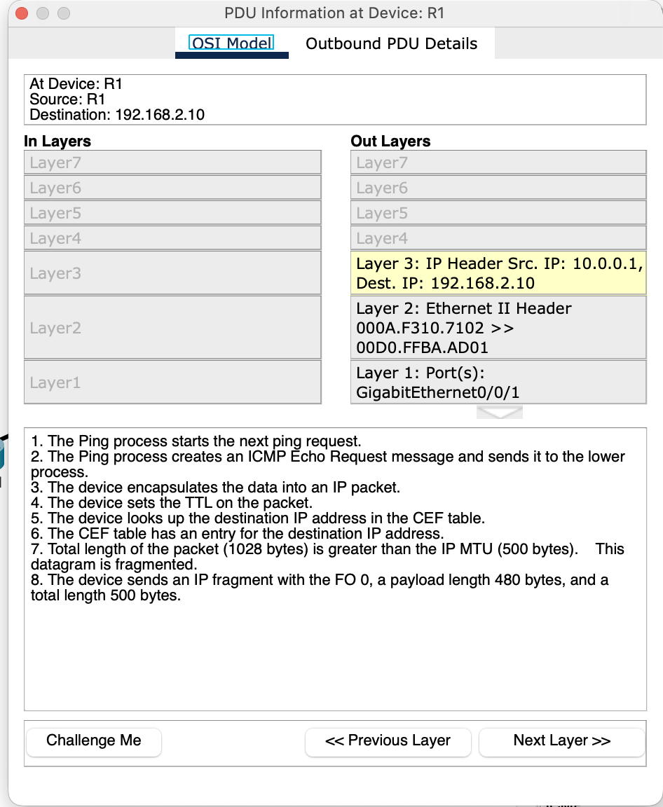
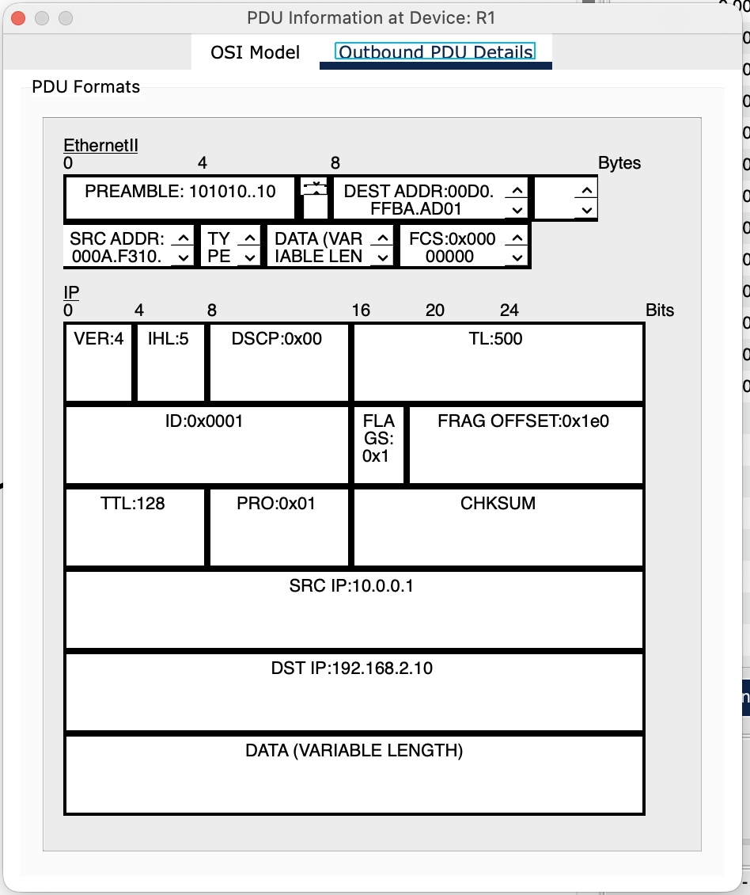
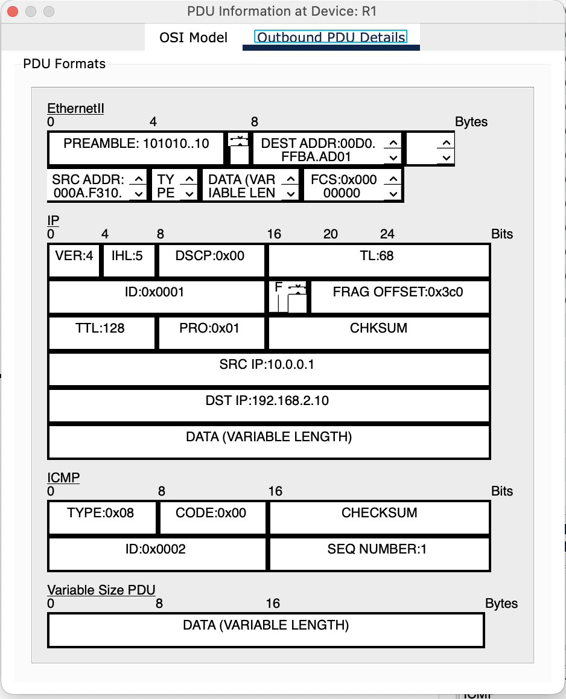
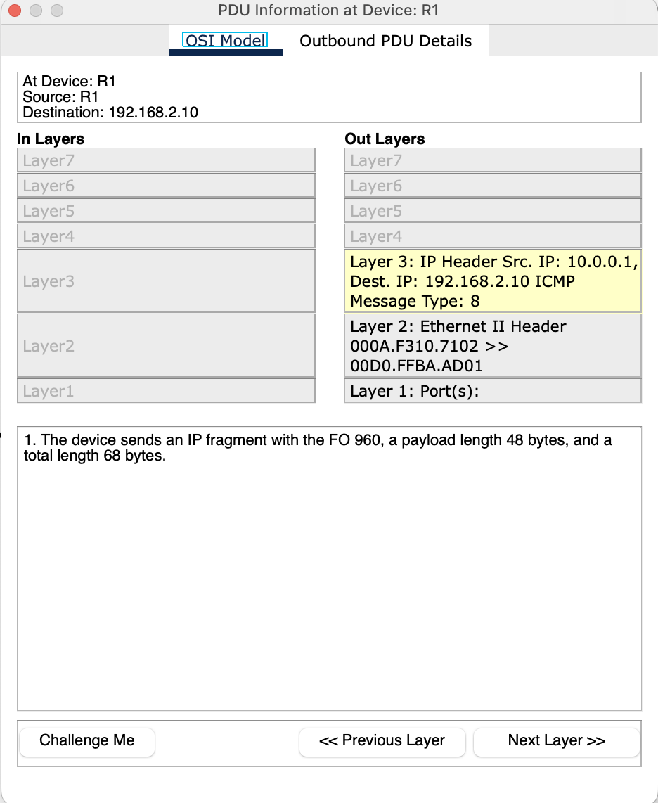

<p style="display: flex; align-items: center;">
  
  <span style="font-family: Arial, sans-serif; line-height: 1.6;">
    <strong>Lab 07</strong><br/>
    <strong>Course:</strong> Networks System Design<br>
    <strong>Name:</strong> Do Davin<br>
    <strong>Student ID:</strong> P20230018<br>
    <strong>Instructor:</strong> Mr. Kuy Movsun<br>
    <strong>Due Date:</strong> Tuesday, 16 December 2025, 12:00 AM
  </span>
</p>
<hr style="border: 1px solid #ccc;">

<br/>

Link to my GitHub:
<a href="https://github.com/Do-Davin/Network-Lab.git">https://github.com/Do-Davin/Network-Lab.git</a>

# Part 1: Network Topology Setup

## 1.1 Devices Required
* Routers: 2× ISR4321/2911 (R1, R2)
* PCs: 2× PCs (PC-A, PC-B)



## Cabling

| From      | To        |
| --------- | --------- |
| PC-A NIC  | R1 G0/0/0 |
| R1 G0/0/1 | R2 G0/0/0 |
| R2 G0/0/1 | PC-B NIC  |

---

## 1.2 Addressing Table

| Device | Interface | IP Address   | Subnet Mask     | Default Gateway |
| ------ | --------- | ------------ | --------------- | --------------- |
| PC-A   | NIC       | 192.168.1.10 | 255.255.255.0   | 192.168.1.1     |
| R1     | G0/0/0    | 192.168.1.1  | 255.255.255.0   | N/A             |
| R1     | G0/0/1    | 10.0.0.1     | 255.255.255.252 | N/A             |
| R2     | G0/0/0    | 10.0.0.2     | 255.255.255.252 | N/A             |
| R2     | G0/0/1    | 192.168.2.1  | 255.255.255.0   | N/A             |
| PC-B   | NIC       | 192.168.2.10 | 255.255.255.0   | 192.168.2.1     |

---

## Router Interface Configuration

```arduino
Router> enable
Router# configure terminal
Router(config)# interface g0/0/0
Router(config-if)# ip address [IP] [MASK]
Router(config-if)# no shutdown
```

Repeat for all interfaces according to the table.

---

# Part 2: Data Plane & Forwarding Tables
## 2.1 Static Routing

Configure R1:

```arduino
R1(config)# ip route 192.168.2.0 255.255.255.0 10.0.0.2
```

Configure R2:

```arduino
R2(config)# ip route 192.168.1.0 255.255.255.0 10.0.0.1
```

---

## 2.2 Connectivity Test

From PC-A

```shell
PC> ping 192.168.2.10
```

A few initial failures are normal due to ARP.



---

# Part 3: Inspecting the IPv4 Header
## 3.1 Simulation Mode Steps

1. enter Simulation Mode
2. Filter for ICMP and IP
3. Ping PC-B again
4. Click Capture/Forward to move packets hop-by-hop



---



---

## 3.2 Activity Questions

Activity Question 1

TTL at R1: Usually TTL = 128 or 64 (depends on OS).

TTL at R2: TTL is decremented by 1 (e.g., from 128 -> 127)

Why did it change?

Every router reduces TTL by 1 to prevent packets from looping forever.

---

## Activity Question 2

Protocol value "1" = ICMP (Internet Control Message Protocol).

Why not TCP (6) or UDP (17)?

Because ping uses ICMP, not TCP/UDP.

## Activity Question 3
Do source/Destination IP change between R1 -> R2?

No! IP addresses stay the same.

What changes?

The MAC addresses in the Ethernet frame are rewritten at every hop (Layer 2 behavior).

---

# Part 4: IP Fragmentation Experiment
## 4.1 Lowering the MTU on R1

```arduino
R1(config)# interface g0/0/1
R1(config-if)# ip mtu 500
```

## Generating a Fragmented Packet

Use Add Complex PDU -> Click R1:
* Destination IP: 192.168.2.10
* Size: 1000 bytes
* Sequence: 1
* Mode: One Shot

---

## 4.3 Observing Fragmentation

Press Capture/Forward once.

## Activity Question 4
How many envelopes do you see?
* You should see 2 fragements, because:
    * MTU = 500 bytes
    * Packet = 1000 bytes
    * Router splits it into two ~500-byte fragments.

---

## Fragment 1 Header Observations
* Total Length ≈ 500 bytes
* More Fragments (MF) = 1
* Fragment Offset = 0

This indicates: “This is the first fragment; more are coming.”

---

## Fragment 2 Header Observations

* More Fragments (MF) = 0 (final fragment)
* Fragment Offset > 0 (usually 60, 65, or similar depending on Packet Tracer block size)

Offset > 0 = “This fragment continues the previous one.”

---

## Activity Question 5
Why is reassembly done at the destination (PC-B) instead of at R2?

Because routers do NOT reassemble fragments.
Reasons:

1. Performance – reassembly is CPU-heavy; routers must stay fast.
2. Risk of buffer overflow – fragments may arrive slowly or out of order.
3. Design rule – only the final destination host reassembles fragmented IP packets.

Therefore, only PC-B reassembles the packet into the original 1000-byte datagram.












