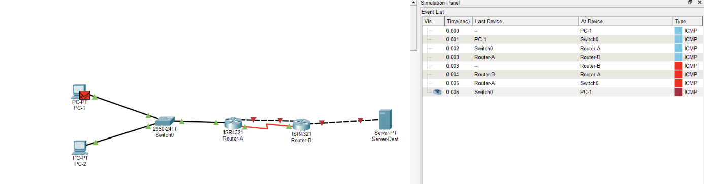
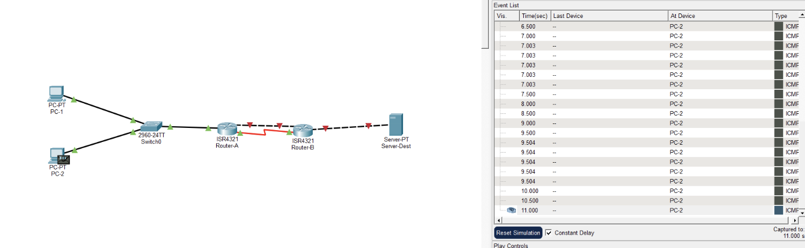
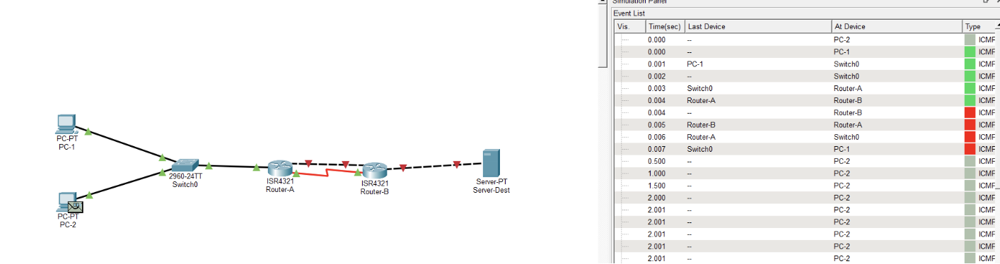
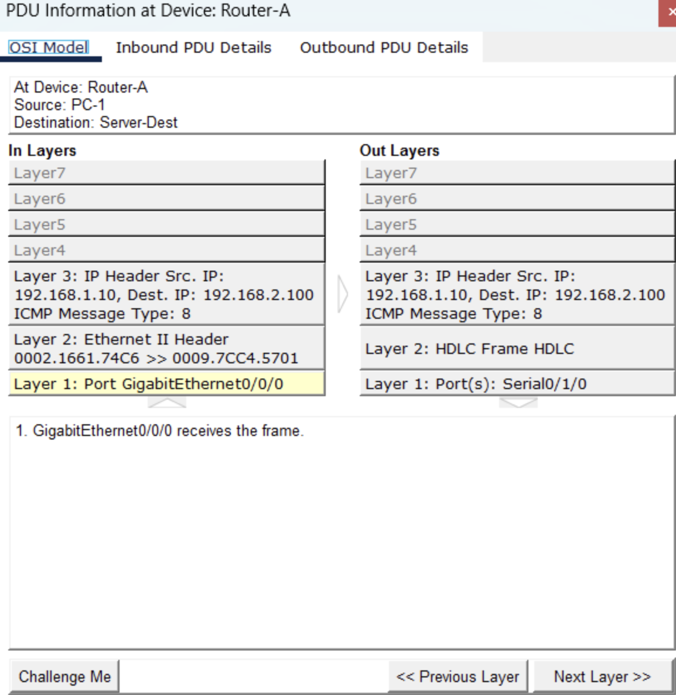
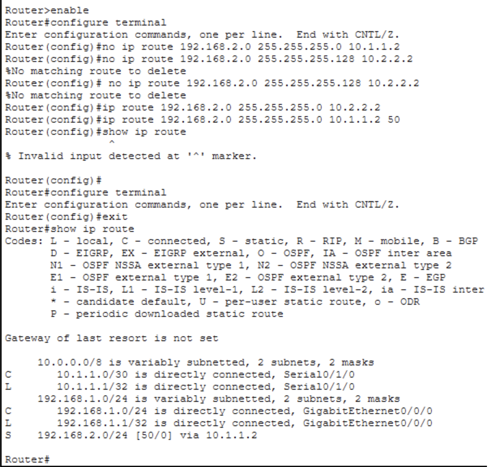
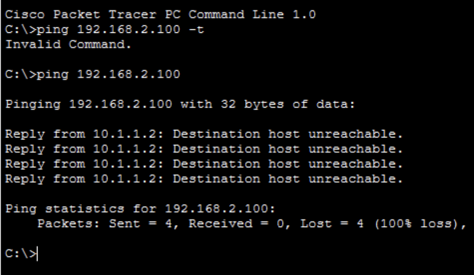

<p style="display: flex; align-items: center;">
  
  <span style="font-family: Arial, sans-serif; line-height: 1.6;">
    <strong>Lab 08</strong><br/>
    <strong>Course:</strong> Networks System Design<br>
    <strong>Name:</strong> Do Davin<br>
    <strong>Student ID:</strong> P20230018<br>
    <strong>Instructor:</strong> Mr. Kuy Movsun<br>
    <strong>Due Date:</strong> Tuesday, 23 December 2025, 12:00 AM
  </span>
</p>
<hr style="border: 1px solid #ccc;">

<br/>

Link to my GitHub:
<a href="https://github.com/Do-Davin/Network-Lab.git">https://github.com/Do-Davin/Network-Lab.git</a>

# Part 1: Dual-Path Topology Setup

## 🖥️ Addressing Table

| Device      | Interface | IP Address    | Subnet Mask     | Description      |
| ----------- | --------- | ------------- | --------------- | ---------------- |
| PC-1        | NIC       | 192.168.1.10  | 255.255.255.0   | Source A         |
| Router-A    | G0/0/0    | 192.168.1.1   | 255.255.255.0   | Gateway          |
| Router-A    | S0/3/0    | 10.1.1.1      | 255.255.255.252 | Path 1 (Serial)  |
| Router-A    | G0/0/1    | 10.2.2.1      | 255.255.255.252 | Path 2 (Gigabit) |
| Router-B    | S0/3/0    | 10.1.1.2      | 255.255.255.252 | Path 1           |
| Router-B    | G0/0/1    | 10.2.2.2      | 255.255.255.252 | Path 2           |
| Router-B    | G0/0/0    | 192.168.2.1   | 255.255.255.0   | Dest Gateway     |
| Server-Dest | NIC       | 192.168.2.100 | 255.255.255.0   | Destination      |

---


# Part 2: Configuring the Bottleneck

## Verify the Link Speed

### Given value

```
Packet size = 1000 bytes = 1000 x 8 = 8000 bits
Gigabit LAN rate = 1 Gbps = 1,000,000,000 bps
Serial WAN rate = 64 kbps = 64,000 bps
```

### Calculation

```
Gigabit LAN
Delay = 8000 / 1,000,000,000 = 0.000008s
=> That's 8 microseconds - essentially instantaneous.
```
```
Serial Link
Delay = 8000 / 64,000 = 0.125s
=> That's 125ms - noticeably slower.
```

- On the Gigabit LAN, the packet is transmitted almost instantly.

- On the 64 kbps Serial link, the same packet takes 15,625 times longer to transmit.

- This huge mismatch is why Router‑A must queue packets when traffic exceeds the serial link’s capacity.

---

# Part 3: Observing Queuing Delay

## 3.1 Baseline Ping (No Congestion)

- **Setup:** Simulation Mode enabled, ICMP filter applied, ping from PC-1 → Server-Dest.
- **Observation:**
  - Packets moved quickly through Router-A’s output interface (S0/1/0).
  - Minimal or no stacking of envelopes in the queue.
- **Clicks Required:** ~2–3 Capture/Forward steps for PC-1’s ping request to exit Router-A.



## 3.2 Generating Background Noise (The Flood)

- **Setup:** PC-2 configured to send 1000-byte packets periodically (0.5s interval) to Server-Dest.
- **Observation:**
  - Router-A’s output queue began filling with PC-2’s packets.
  - Continuous traffic kept the interface busy.



---

## 3.3 Measuring Delay Under Load

- **Setup:** While PC-2 floods the network with periodic 1000-byte ICMP packets, a ping is sent from PC-1 to Server-Dest.
- **Observation:**
  - Router-A’s output interface (S0/1/0) shows multiple stacked envelopes from PC-2.
  - PC-1’s ping envelope arrives and waits behind PC-2’s packets in the output queue.
  - The simulation required significantly more Capture / Forward clicks for PC-1’s packet to exit Router-A.
- **Clicks Required:**
  - Baseline (no congestion): ~2–3 clicks.
  - Under load: ~8–12 clicks before PC-1’s ping exited Router-A.
- **Conclusion:**
  - Queuing delay increases when the router is congested.
  - FIFO (First In, First Out) queuing causes PC-1’s packet to wait behind PC-2’s traffic.
  - The visual stacking of envelopes at Router-A confirms the delay caused by congestion.



---

## Activity Questions

**Q1. Baseline (no traffic):**

- PC-1’s ping request required ~2–3 Capture/Forward clicks to exit Router-A’s output queue.

**Q2. Under congestion (with PC-2 flooding):**

- PC-1’s ping request required ~6–8 clicks.
- The visual queue buildup showed multiple envelopes stacked at Router-A’s S0/1/0 interface.

**Q3. Explanation:**

- PC-1’s packet took more simulation steps because Router-A’s output queue was busy with PC-2’s traffic.
- In FIFO (First In, First Out) queuing, PC-1’s packet had to wait until earlier packets were transmitted.
- The **Output Queue visualization** (stacked envelopes) demonstrated how congestion increases queuing delay.

---

## Part 4: Observing Packet Loss (Tail Drop)

### 4.1 Intensify the Traffic

- **Change:** PC-2 Complex PDU interval set to **0.1s** with **1000-byte** packets.
- **Reason:** 1000 bytes / 0.1s ≈ 80 kbps demand; link capacity is **64 kbps**, ensuring buffer overflow and drops.

### 4.2 Observe the Drop

- **Observation:** After ~10–20 Capture/Forward steps, a packet at **Router-A S0/1/0** turns into a **red flame/X**, indicating a drop.

### 4.3 Analyze the Drop Reason

- **Exact message (copied from PDU Information → OSI Model):**


### Activity Question 3

- **Answer:** The simulator’s drop reason was:
  - “**\*\***\*\***\*\***\_\_\_**\*\***\*\***\*\***” (exact wording from OSI tab).

### Activity Question 4

- **Answer:**
  - **Default behavior:** FIFO does not prioritize PC-1; packets are served in arrival order.
  - **Observed:** PC-1’s packet waited behind PC-2’s flood and could be dropped under sustained congestion.

### Activity Question 5

- **Answer:**
  - **Mechanism:** Implement **QoS** on Router-A (e.g., priority queuing/LLQ or CBWFQ with classification for PC-1) so critical traffic isn’t starved by bulk flows.
  - **Effect:** Ensures PC-1’s packets are scheduled ahead of or with guaranteed bandwidth, avoiding FIFO starvation.

---

## Part 5: Longest Prefix Match (LPM)

### 5.1 Enable Both Links

- **Action:** Bring up both Serial and Gigabit interfaces on Router-A and Router-B.
- **Commands:**

  ```bash
  Router-A(config)# interface s0/1/0
  Router-A(config-if)# no shutdown
  Router-A(config)# interface g0/0/1
  Router-A(config-if)# no shutdown

  Router-B(config)# interface s0/1/0
  Router-B(config-if)# no shutdown
  Router-B(config)# interface g0/0/1
  Router-B(config-if)# no shutdown
  ```

### 5.2 Configure Competing Routes

Router-A(config)# ip route 192.168.2.0 255.255.255.0 10.1.1.2
Router-A(config)# ip route 192.168.2.0 255.255.255.128 10.2.2.2

### 5.3 Predict & Verify

- **Prediction:**

  - IP `192.168.2.100` matches the `/24` route but not the `/25` route.
  - Router-A will choose the `/24` route via the **Serial link**.

- **Verification (Simulation Mode):**
  - Ping sent from PC-1 to Server-Dest.
  - At Router-A, the packet exited through **Serial0/1/0**.
  - This confirms that the router selected the `/24` route.



---

## Part 6: Floating Static Routes (Backup Link)

### 6.1 Cleanup

- Removed overlapping routes from Part 5.

### 6.2 Configure Primary and Backup Routes

- **Primary Route:**  
  `ip route 192.168.2.0 255.255.255.0 10.2.2.2` (Gigabit link, AD = 1)
- **Backup Route:**  
  `ip route 192.168.2.0 255.255.255.0 10.1.1.2 50` (Serial link, AD = 50)

### 6.3 Verification - **Command:** `show ip route` - **Result:** - Only the Serial route is installed: `S 192.168.2.0/24 [50/0] via 10.1.1.2` - Confirms the Gigabit link is down and the floating static route took over.



### 6.4 Simulate Failure

- **Action:**

  - A continuous ping was initiated from **PC-1** to `192.168.2.100`.
  - The command `ping 192.168.2.100` was used in PC-1’s Command Prompt.

- **Observation:**

  - The ping replies came from `10.1.1.2` with the message:  
    **"Destination host unreachable."**
  - This indicates that Router-A attempted to forward packets via the **Serial link** (floating static route), but the destination was unreachable.

- **Routing Table Check (Router-A):**

  - The command `show ip route` showed:
    ```
    S 192.168.2.0/24 [50/0] via 10.1.1.2
    ```
  - This confirms that the **floating static route (AD = 50)** was activated due to Gigabit link failure.



- **Conclusion:**
  - Router-A successfully switched to the backup route via Serial link.
  - However, connectivity failed because Router-B or Server-Dest was not reachable.
  - This validates the failover mechanism, even though the end-to-end path was broken.

### Activity Question 8

- **Answer:**
  - After the Gigabit link failure, Router-A’s routing table showed the backup route via `10.1.1.2`.
  - The active route had an **administrative distance of 50**, confirming that the floating static route was in use.