

  
  
    <strong>Lab 09</strong> 
    <strong>Course:</strong> Networks System Design 
    <strong>Name:</strong> Do Davin 
    <strong>Student ID:</strong> P20230018 
    <strong>Instructor:</strong> Mr. Kuy Movsun 
    <strong>Due Date:</strong> Tuesday, 30 December 2025, 12:00 AM
  

 

# 1. Topology & Addressing

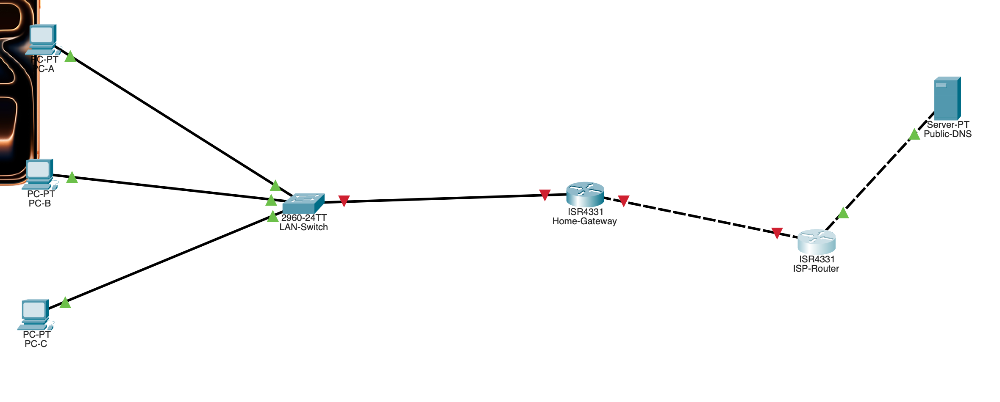
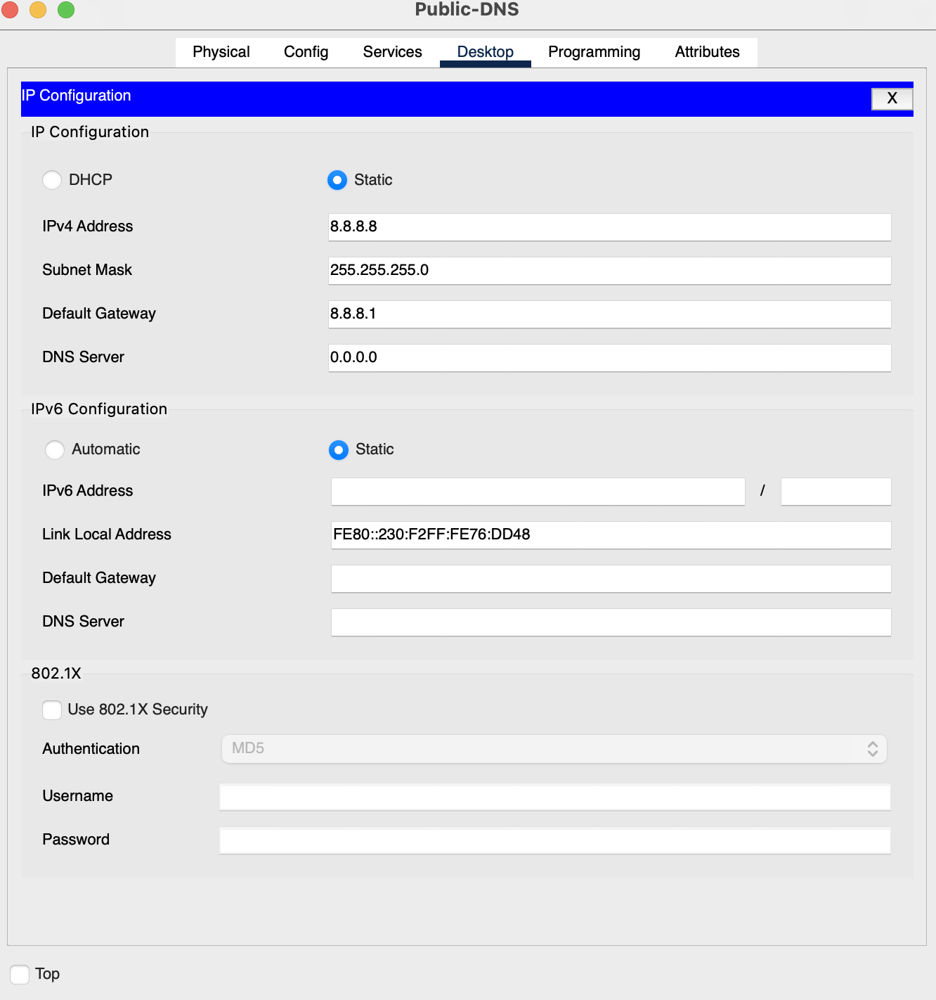
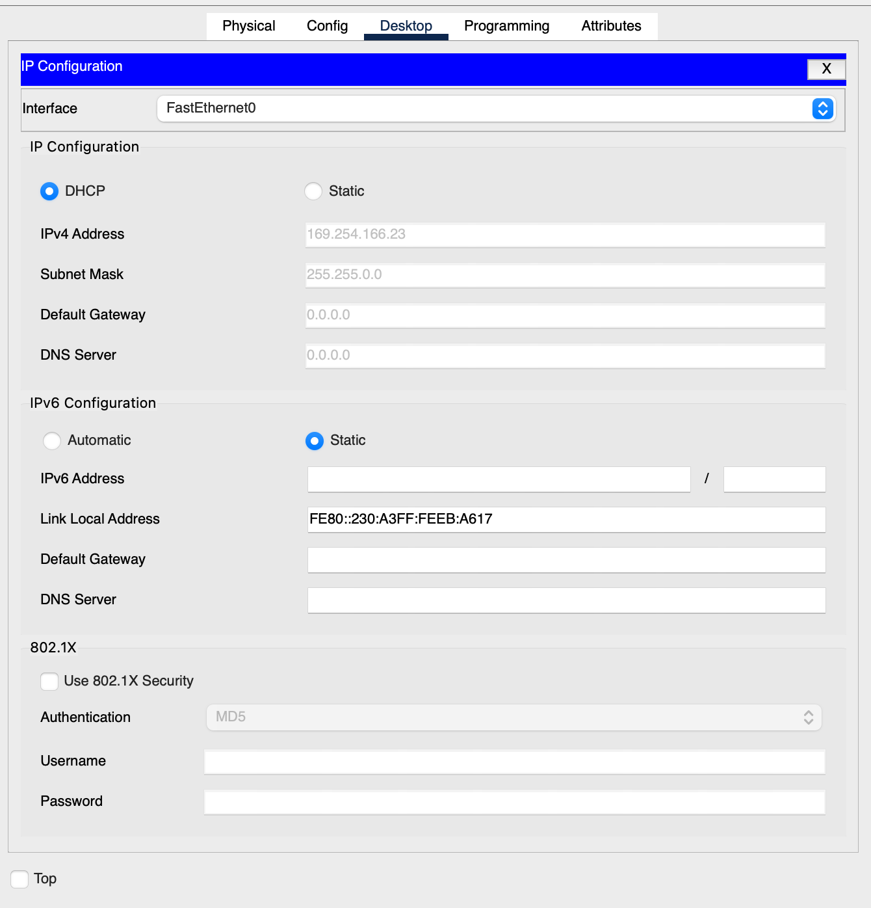

# 2. Pre-Lab Setup (Instructor Configuration)

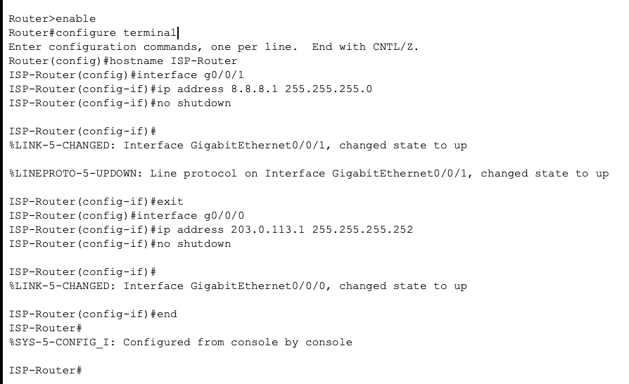

# 3. Implementing NAT (Network Address Translation)

### Step 3A: Configure WAN Link & Default Route
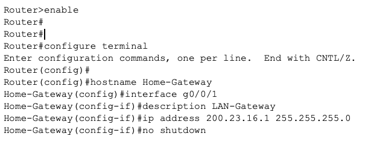

### Step 3B: Re-configure LAN as Private Network
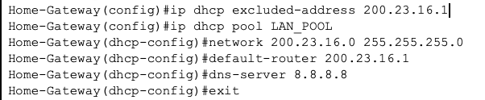

### Step 3C: Force PCs to renew IP
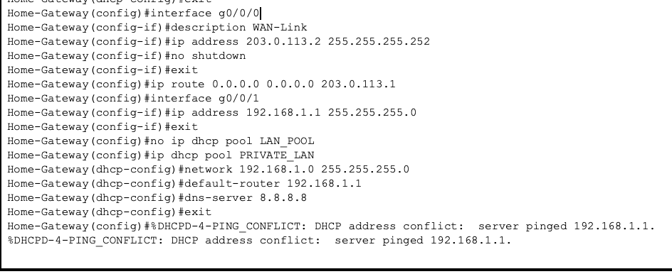

## Step 3D: Configure NAT Overload (PAT)
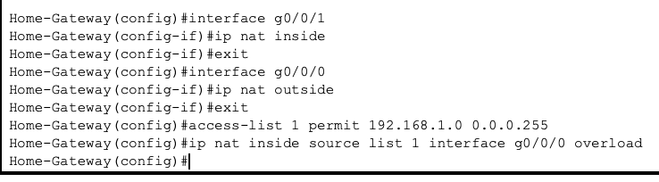

### Verification: Open Command Prompt on PC-A. Ping 8.8.8.8.
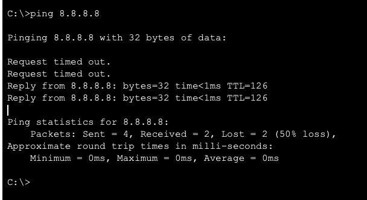

# Task 4
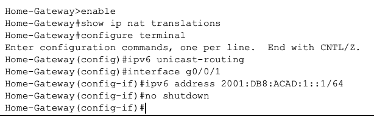
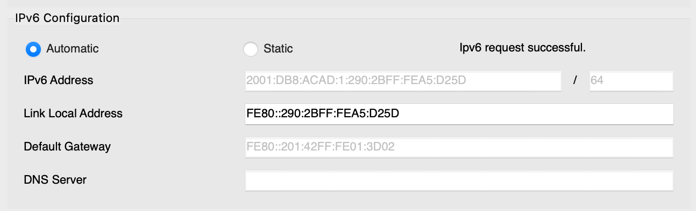