

  
  
    <strong>Lab 10</strong> 
    <strong>Course:</strong> Networks System Design 
    <strong>Name:</strong> Do Davin 
    <strong>Student ID:</strong> P20230018 
    <strong>Instructor:</strong> Mr. Kuy Movsun 
    <strong>Due Date:</strong> Due: Tuesday, 13 January 2026, 12:00 AM
  

 

# Part 1: The Link State Walkthrough (Dijkstra)

## 1. The Topology

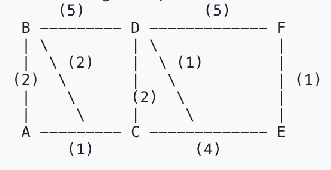

## 2. The Calculation Table

| Step | N' (Nodes added) | D(B), p(B) | D(C), p(C) | D(D), p(D) | D(E), p(E) | D(F), p(F) |
|------|------------------|------------|------------|------------|------------|------------|
| 0    | A                | 2, A       | 1, A       | ∞          | ∞          | ∞          |
| 1    | A, C             | 2, A       | 1, A       | 3, C       | 5, C       | ∞          |
| 2    | A, C, B          | 2, A       | 1, A       | 3, C       | 5, C       | ∞          |
| 3    | A, C, B, D       | 2, A       | 1, A       | 3, C       | 4, D       | 8, D       |
| 4    | A, C, B, D, E    | 2, A       | 1, A       | 3, C       | 4, D       | 5, E       |
| 5    | A, C, B, D, E, F | 2, A       | 1, A       | 3, C       | 4, D       | 5, E       |

## 3. The Result

* Shortest path A → F:
* A → C → D → E → F
* Total cost: 5
* Next hop from A to reach F: C

# Part 2: The "Count-to-Infinity" Simulation (Distance Vector)

| State        | Y's Table (Cost to Z)                                                                 | X's Table (Cost to Z)                                  |
|-------------|----------------------------------------------------------------------------------------|--------------------------------------------------------|
| **Initial** | Cost: 1 (Direct)                                                                      | Cost: 5 (Next Hop: Y)                                  |
| **Link Change** | Detects new cost 60. Checks X's advertisement: “X can reach Z with cost 5”        | (Has not received update yet) Cost: 5                  |
| **Iteration 1** | Updates route via X: 4 (to X) + 5 (X to Z) = 9. Y tells X: “I can reach Z with cost 9” | Receives Y's update (9). Updates own cost: 4 (to Y) + 9 (Y to Z) = **13** |
| **Iteration 2** | Receives X's update (13). New Cost: 4 + 13 = **17**                               | Receives Y's update (17). New Cost: 4 + 17 = **21**    |

### Question: Why is this behavior called "Bad news travels slow"?
* Answer: Because when the link Y–Z becomes very expensive (cost 60), that bad news does not spread immediately in a distance-vector protocol.
Each router only knows what its neighbor advertises, so X and Y keep telling each other apparently “good” routes and gradually increase the cost step-by-step (5 → 9 → 13 → 17 → 21 → …) instead of jumping directly to 60 (or infinity).

# Part 3: Packet Tracer Activity (RIP)

## 1. Setup Topology

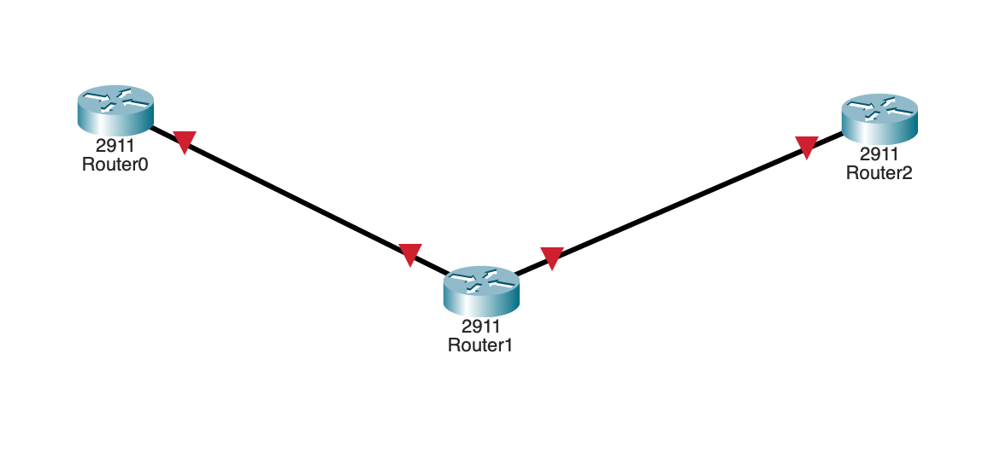

## 2. IP Configuration

* Router0 (G0/0): 192.168.1.1 255.255.255.0  
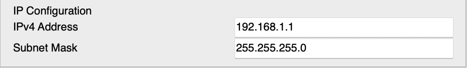
* Router1 (G0/0): 192.168.1.2 255.255.255.0  
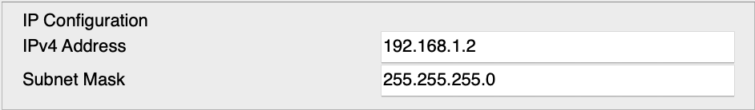
* Router1 (G0/1): 192.168.2.1 255.255.255.0  
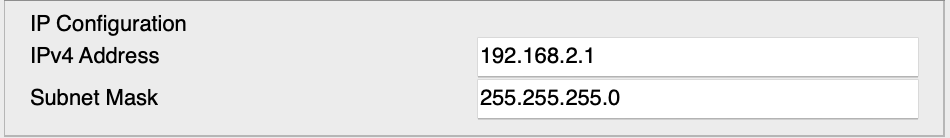
* Router2 (G0/0): 192.168.2.2 255.255.255.0  
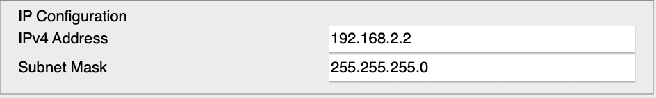
* Router2 (Loopback0): 10.10.10.1 255.255.255.0  
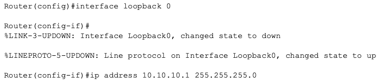

## 3. Enable RIP Routing

* Router0  
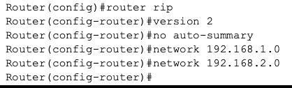
* Router1  
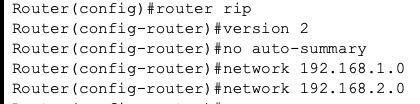
* Router2  
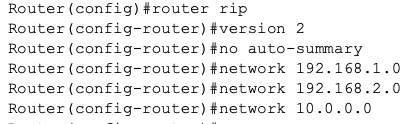
## 4. Verification

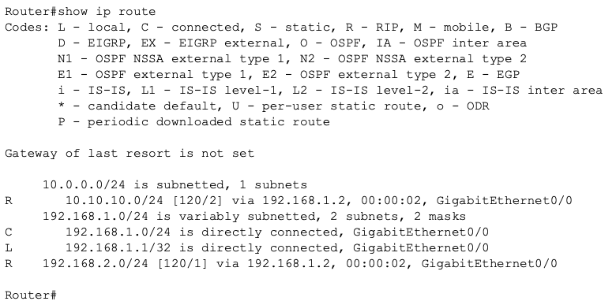

In the RIP routing entry `[120/2]`, what does the **2** represent?

### Answer
The **2** represents the **hop count** to reach the destination network.

A hop count is the number of routers (or “hops”) that a packet must travel through to get from the source router to the destination network.  
In this case, a value of **2** means:

- There are **two intermediate routers** between Router0 and the destination network.
- The packet will pass through two routing devices before arriving at its final network.
- This value increases each time a route is forwarded through another RIP-enabled router.

Since RIP is a **distance-vector protocol**, hop count is the metric it uses to determine the best path.  
The lower the hop count, the better the route.

So simply:
**Hop Count (2) = Router0 → Router1 → Router2 → Destination**

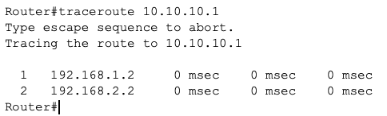