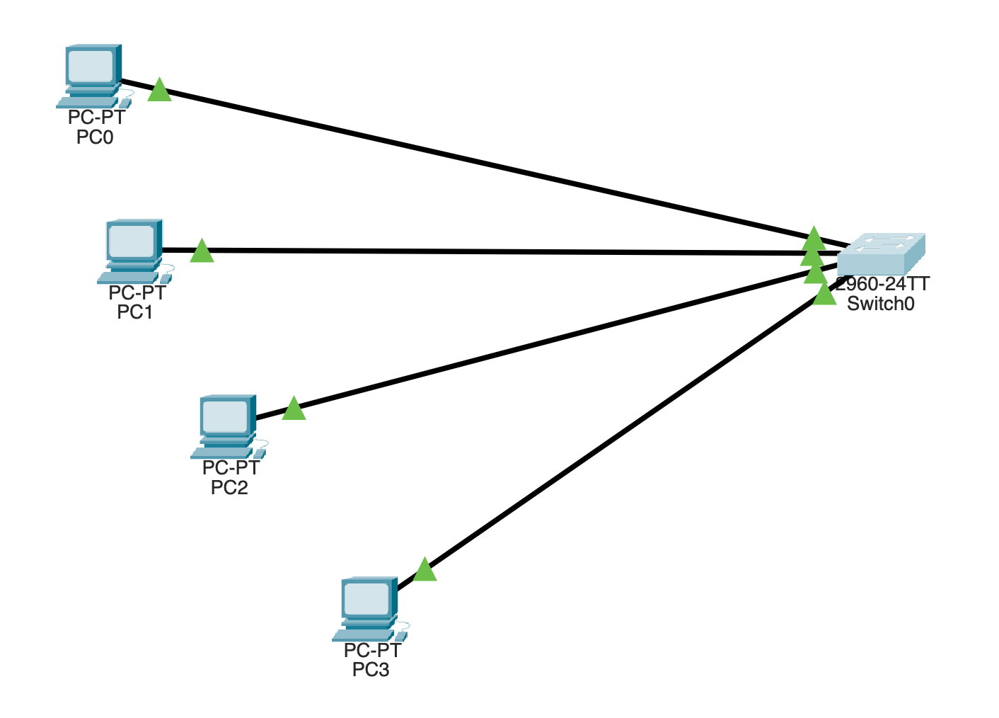
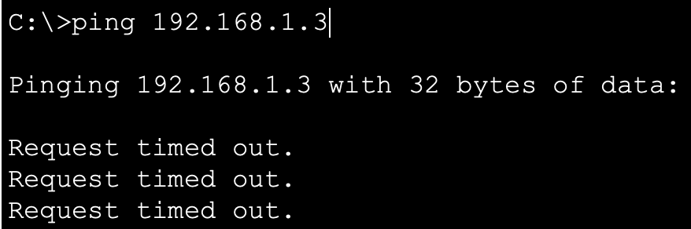
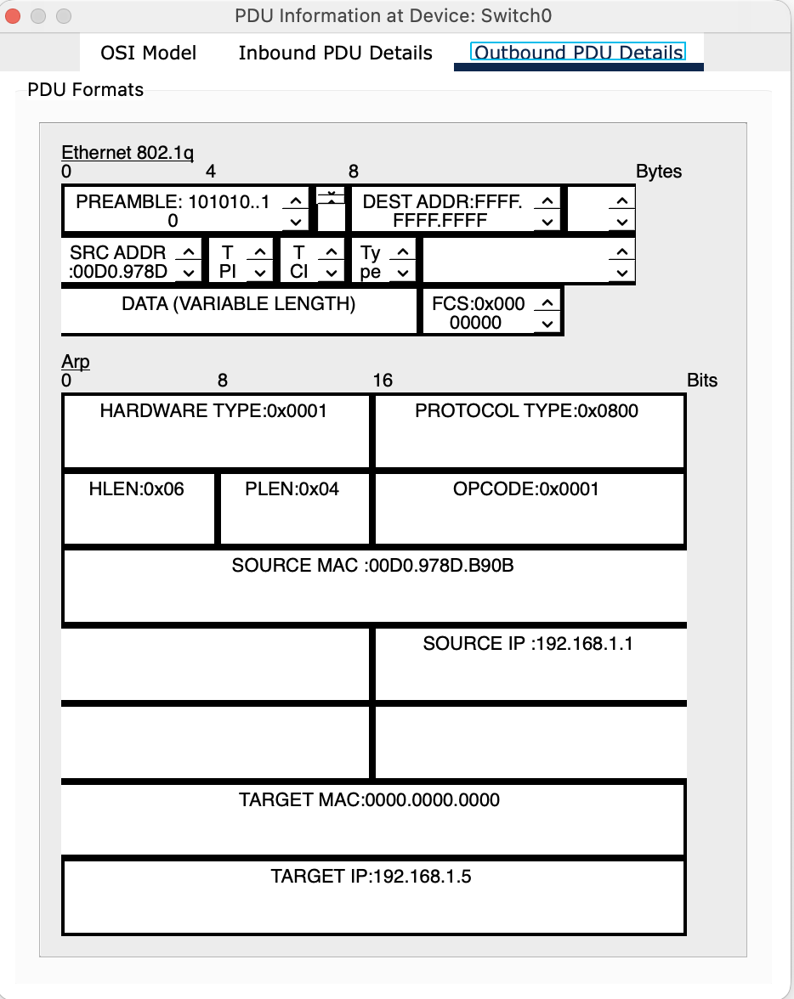

<p style="display: flex; align-items: center;">
  
  <span style="font-family: Arial, sans-serif; line-height: 1.6;">
    <strong>Lab 12</strong><br/>
    <strong>Course:</strong> Networks System Design<br>
    <strong>Name:</strong> Do Davin<br>
    <strong>Student ID:</strong> P20230018<br>
    <strong>Instructor:</strong> Mr. Kuy Movsun<br>
  </span>
</p>
<hr style="border: 1px solid #ccc;">

<br/>

# Part 1: Configuring Port-Based VLANs and Traffic Isolation

* Build the Topology: Connect four PCs to a 2960 Switch using ports Fa0/1 through Fa0/4:



* Create VLANs: Access the Switch CLI and create two VLANs:

```css
Switch>enable
Switch#config t
Switch(config)#vlan 10
Switch(config-vlan)#name Engineering
Switch(config-vlan)#vlan 20
Switch(config-vlan)#name Marketing
Switch(config-vla)#exit
```

* Assign Ports:

```css
Switch(config)#interface range fa0/1 - 2
Switch(config-if-range)#switchport mode access
Switch(config-if-range)#switchport access vlan 10
Switch(config-if-range)#exit
Switch(config)#interface range fa0/3 - 4
Switch(config-if-range)#switchport mode access
Switch(config-if-range)#switchport access vlan 20
```

* Test Connectivity:



---

# Part 2: Multi-Switch VLANs and 802.1Q Trunking

* Switch 2:

```css
Switch>enable
Switch#config t
Switch(config)#interface gig0/1
Switch(config-if)#switchport mode trunk

Switch(config-if)#
%LINEPROTO-5-UPDOWN: Line protocol on Interface GigabitEthernet0/1, changed state to down

%LINEPROTO-5-UPDOWN: Line protocol on Interface GigabitEthernet0/1, changed state to up
```

* Switch 1:

```css
Switch>enable
Switch#config t
Enter configuration commands, one per line.  End with CNTL/Z.
Switch(config)#interface gig0/1
Switch(config-if)#switchport mode trunk
```

* Inspect the PDU details on the trunk link to find the 802.1Q Tag and the VLAN ID.



---

# Part 3: Inter-VLAN Routing (Router-on-a-Stick)

* Router:

```css
Router>enable
Router#
Router#configure terminal
Enter configuration commands, one per line.  End with CNTL/Z.
Router(config)#interface GigabitEthernet0/0
Router(config-if)#exit
Router(config)#interface g0/0
Router(config-if)#no shutdown

Router(config-if)#
%LINK-5-CHANGED: Interface GigabitEthernet0/0, changed state to up

%LINEPROTO-5-UPDOWN: Line protocol on Interface GigabitEthernet0/0, changed state to up

Router(config-if)#exit
Router(config)#interface g0/0.10
Router(config-subif)#
%LINK-3-UPDOWN: Interface GigabitEthernet0/0.10, changed state to down

%LINEPROTO-5-UPDOWN: Line protocol on Interface GigabitEthernet0/0.10, changed state to up

Router(config-subif)#encapsulation dot1q 10
Router(config-subif)#ip address 192.168.10.1 255.255.255.0
Router(config-subif)#exit
Router(config)#interface g0/0.20
Router(config-subif)#
%LINK-3-UPDOWN: Interface GigabitEthernet0/0.20, changed state to down

%LINEPROTO-5-UPDOWN: Line protocol on Interface GigabitEthernet0/0.20, changed state to up

Router(config-subif)#encapsulation dot1q 20
Router(config-subif)#ip address 192.168.20.1 255.255.255.0
Router(config-subif)#
Router#
```

* Switch 0:

```css
Switch>enable
Switch#config t
Enter configuration commands, one per line.  End with CNTL/Z.
Switch(config)#interface gig0/1
Switch(config-if)#switchport mode trunk
Switch(config-if)#
%LINK-5-CHANGED: Interface FastEthernet0/5, changed state to up

%LINEPROTO-5-UPDOWN: Line protocol on Interface FastEthernet0/5, changed state to up

Switch(config-if)#exit
Switch(config)#
%LINK-3-UPDOWN: Interface FastEthernet0/5, changed state to down

%LINEPROTO-5-UPDOWN: Line protocol on Interface FastEthernet0/5, changed state to down

%LINK-5-CHANGED: Interface FastEthernet0/24, changed state to up

%LINEPROTO-5-UPDOWN: Line protocol on Interface FastEthernet0/24, changed state to up

Switch(config)#interface fa0/24
Switch(config-if)#switchport mode trunk

Switch(config-if)#
%LINEPROTO-5-UPDOWN: Line protocol on Interface FastEthernet0/24, changed state to down

%LINEPROTO-5-UPDOWN: Line protocol on Interface FastEthernet0/24, changed state to up

Switch(config-if)#exit
Switch(config)#interface GigabitEthernet0/1
Switch(config-if)#exit
Switch(config)#interface gig0/1
Switch(config-if)#switchport mode trunk
```

* switch 1:

```css
```

---


# Part 4: Synthesis Challenge - "A Day in the Life"