

  
  
    <strong>Lab 13</strong> 
    <strong>Course:</strong> Networks System Design 
    <strong>Name:</strong> Do Davin 
    <strong>Student ID:</strong> P20230018 
    <strong>Instructor:</strong> Mr. Kuy Movsun 
  

 

# Part 1: Infrastructure Mode & Connectivity

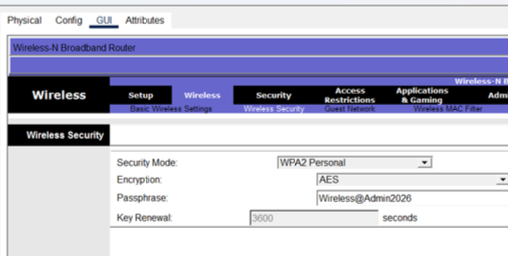

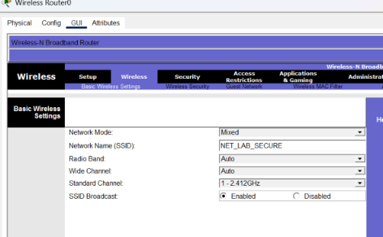

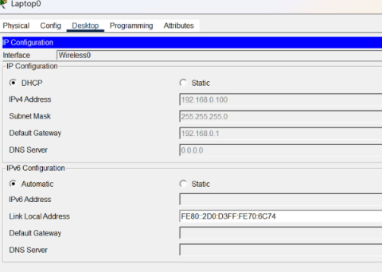

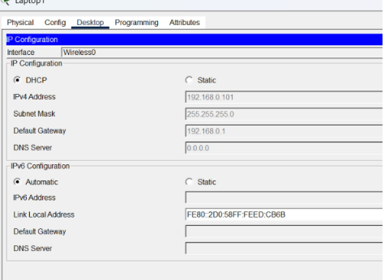

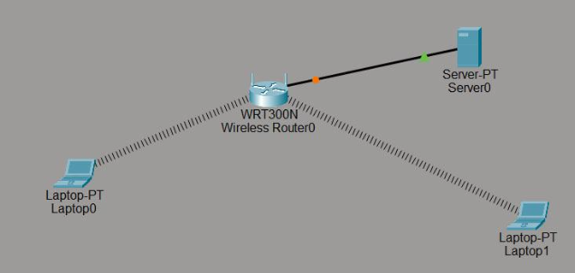

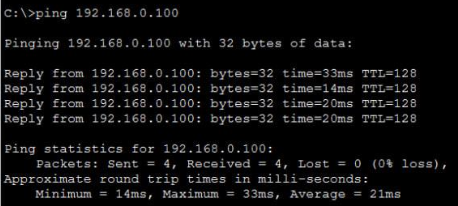

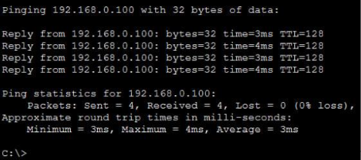

# Part 2: Analyzing Wireless Management Frames

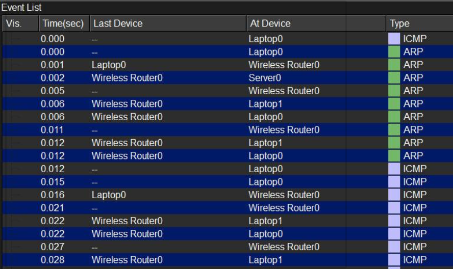

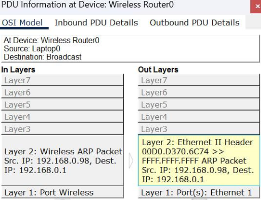

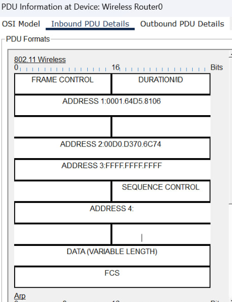

# Part 3: Channel Management and Frequency Reuse

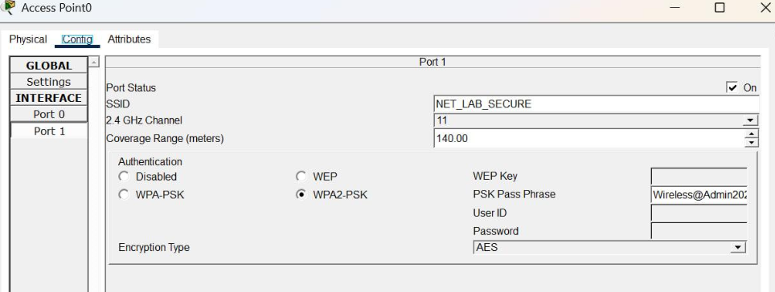

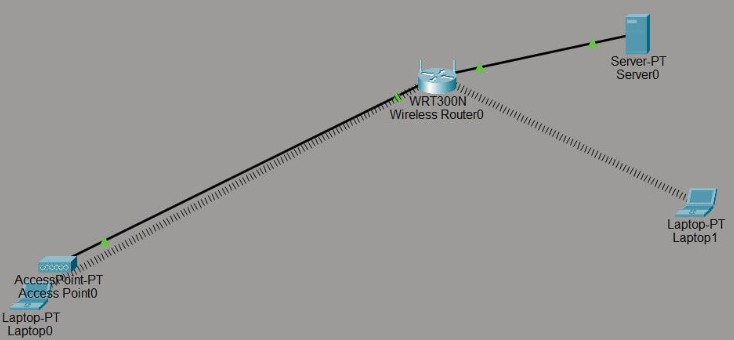

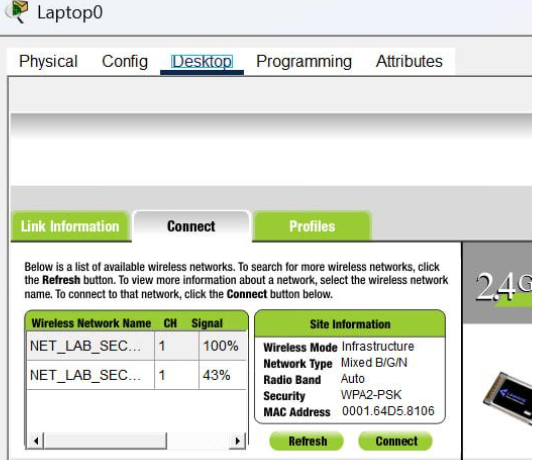

# Part 4: Implementing Layer 2 Security

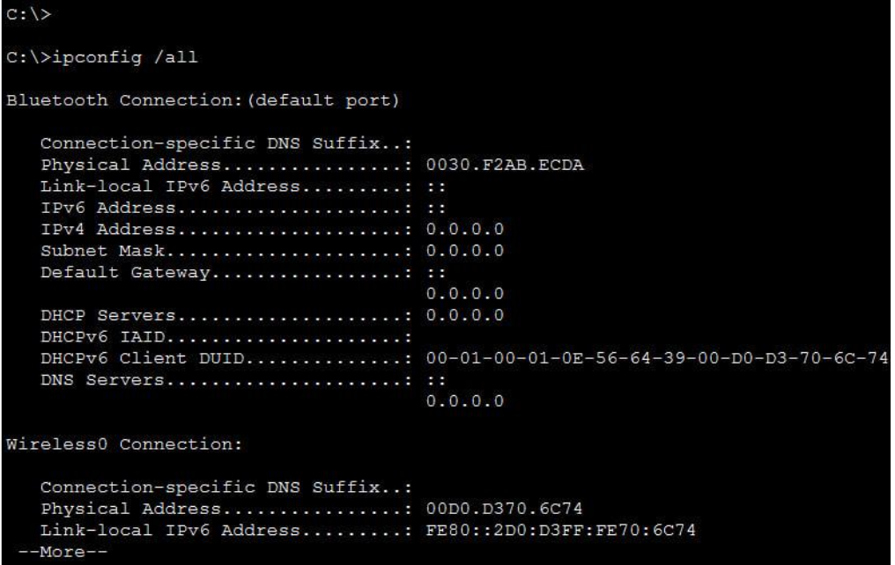

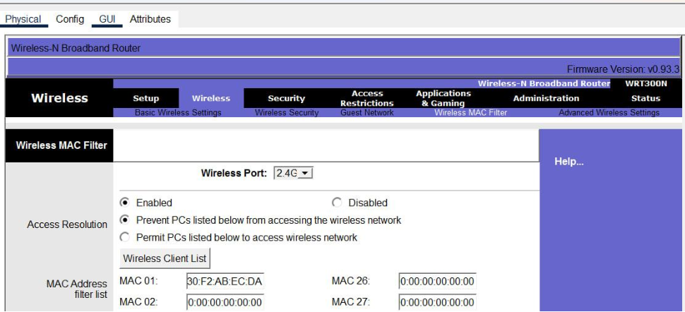

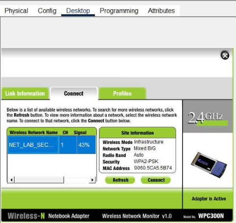

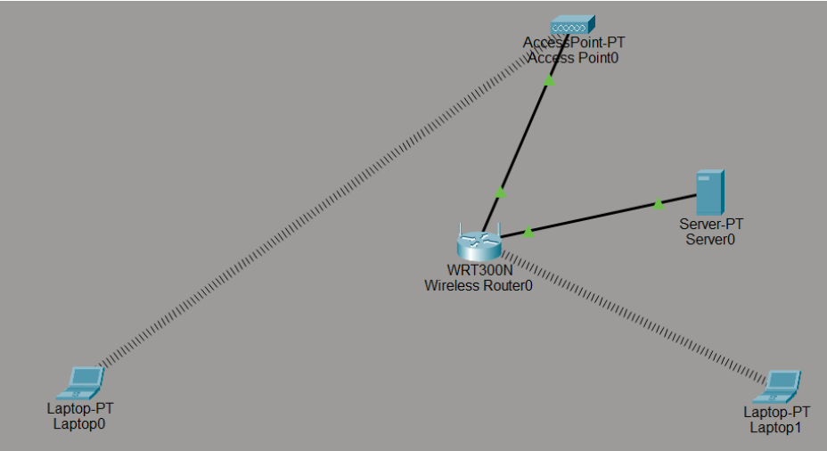

## Questions:
1. Why do we use non-overlapping channels like 1, 6, and 11 in professional deployments?
2. What happened to the connection when you applied the MAC filter? Is this an effective
security measure on its own?
3. In Simulation Mode, what is the main difference you noticed between a "Beacon" frame
and an "Association" frame?
## Answers:
1. We don’t use non-overlapping channels (1, 6, and 11) in professional deployments because it prevent interference between adjacent access points. 2.4GHz channels
overlap, but these three have 25MHz separation so they don't interfere. Allows multiple
APs in same area without performance degradation.
2. When you applied the MAC filter, the router blocked the connection from laptop0 immediately while Laptop1 worked normally. It’s not an effective security measure on
its own because it easily bypass MAC spoofing.
3. **Beacon**:
        * AP -> Broadcast, periodic advertisements
        * ongoing advertisements
    **Association:**
        * Client -> Specific AP, connection request
        * one-time connection setup.